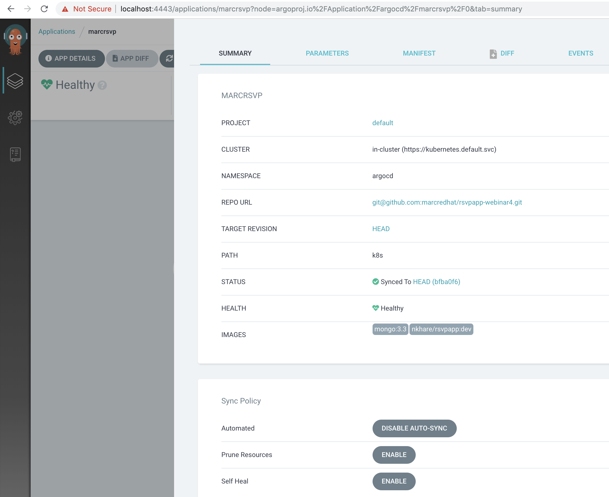

== GitOps with OpenShift 4.2 and Argo CD 

Inspired by https://www.digitalocean.com/community/tutorials/webinar-series-gitops-tool-sets-on-kubernetes-with-circleci-and-argo-cd

See video no. 13 at http://bit.ly/marcredhatplaylist

See also http://bit.ly/marcredhat

----
oc new-project argocd
oc apply -n argocd -f https://raw.githubusercontent.com/argoproj/argo-cd/release-1.2/manifests/install.yaml
sudo curl -L  https://github.com/argoproj/argo-cd/releases/download/v1.2.2/argocd-linux-amd64 -o /usr/bin/argocd
sudo chmod +x /usr/bin/argocd
----

----
oc get svc -n argocd argocd-server
NAME            TYPE        CLUSTER-IP      EXTERNAL-IP   PORT(S)          AGE
argocd-server   ClusterIP   172.30.68.116   <none>        80/TCP,443/TCP   4m3s
----

----
oc port-forward svc/argocd-server -n argocd 4443:443 &
----

----
ssh -L 4443:localhost:4443 demouser@<CodeReady Containers physical server>
----

Go to https://localhost:4443

Get ArgoCD password

----
oc get pods -n argocd  -o name | cut -d'/' -f 2 | grep argocd-server
argocd-server-67c565645c-zdrmt
----

----
argocd login localhost:4443
Login as admin/<value above>, argocd-server-67c565645c-zdrmt in this example
----

----
argocd account update-password
argocd relogin
----

Add github repo

----
argocd repo add git@github.com:marcredhat/rsvpapp-webinar4.git --ssh-private-key-path ~/.ssh/id_rsa
repository 'git@github.com:marcredhat/rsvpapp-webinar4.git' added
----

----
oc adm policy add-scc-to-group anyuid system:authenticated
----

Configure your application in Argo CD:

 
