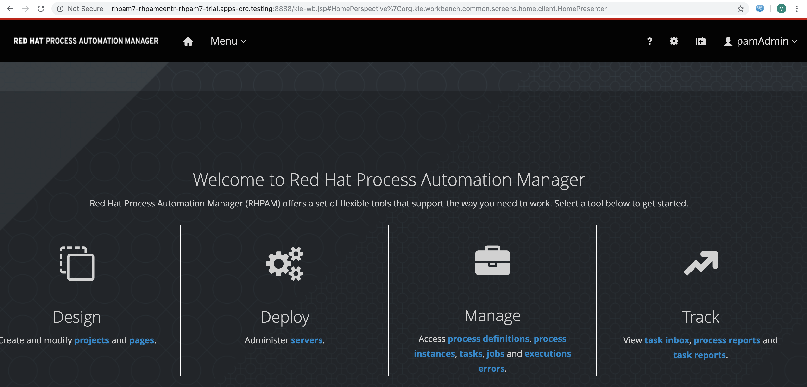
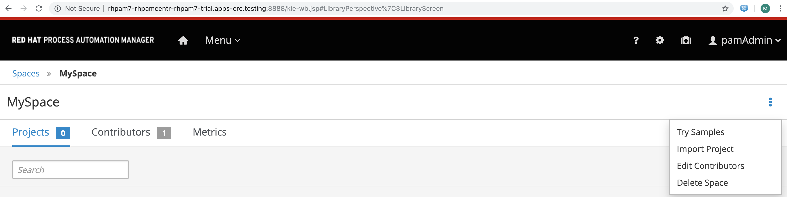
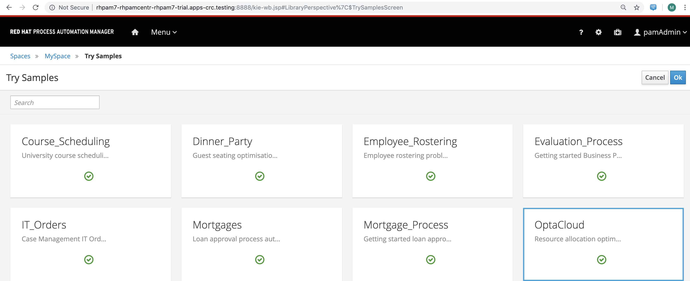
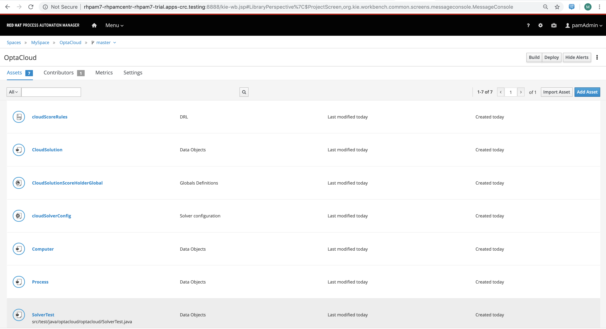

== Red Hat CodeReady Containers (Minishift equivalent for OpenShift 4.1 or newer)

== Draft lab guide showing how to set up 

- CodeReady Containers / OpenShift 4.1

- Ansible Agnostic Deployer

- OpenDataHub

- Process Automation Manager

- Change Data Capture with Debezium and Kafka

- Tekton Pipelines 

*Red Hat CodeReady Containers* brings a minimal OpenShift 4.1 or newer cluster to your local computer
(see https://code-ready.github.io/crc/)

*Ansible Agnostic Deployer* aka AgnosticD, is a fully automated 2 Phase deployer for building and deploying everything from basic infrastructure to fully configured running application environments running on either public Cloud Providers or OpenShift clusters.

AgnosticD is not an OpenShift Deployer, though it can and does that, it is however also a deployer that just happens to be used to deploy a lot of OpenShift and OpenShift workloads, amongst other things. See https://github.com/redhat-cop/agnosticd

*Open Data Hub* is a machine-learning-as-a-service platform built on Red Hat's Kubernetes-based OpenShift® Container Platform, Ceph Object Storage, and Kafka/Strimzi integrating a collection of open source projects. See https://opendatahub.io/

The instructions below cover

- installing Red Hat CodeReady Containers on a RHEL 8.1 *physical* server 

- using Ansible Agnostic Deployer to deploy OpenDataHub on OpenShift 4.1

- configuring SSH tunneling / port forwarding to access the OpenShift console, OpenDataHub etc from your laptop.

[marc@dell-r730-019 ~]$ cat /etc/redhat-release

----
Red Hat Enterprise Linux release 8.1 Beta (Ootpa)
----

== Install packages

su -c 'dnf -y install git wget tar qemu-kvm libvirt NetworkManager jq'

sudo systemctl start libvirtd

sudo systemctl enable libvirtd

== Install Python

See https://developers.redhat.com/blog/2019/05/07/what-no-python-in-red-hat-enterprise-linux-8/

yum install @python36

yum install @python27

When you install either (or both) you can easily make 
/usr/bin/python point to the right place using alternatives --config python

[root@dell-r730-019 ~]#  alternatives --config python

----
There are 3 programs which provide 'python'.

  Selection    Command
*+ 1           /usr/libexec/no-python
   2           /usr/bin/python2
   3           /usr/bin/python3
----
Choose 3 

[marc@dell-r730-019 ansible]$ python -V

----

Python 3.6.8

----

== Add user

adduser marc

passwd marc

usermod -aG wheel marc

== Install Go

cd /home/marc

wget https://dl.google.com/go/go1.12.9.linux-amd64.tar.gz

tar -xzf go1.12.9.linux-amd64.tar.gz

Add to .bashrc:

----
export GOROOT=/home/marc/go

export GOPATH=/home/marc/work

export PATH=$GOPATH/bin:$GOROOT/bin:$PATH
----

source .bashrc

== Install CodeReady Containers

wget https://mirror.openshift.com/pub/openshift-v4/clients/crc/1.0.0-beta.3/crc-linux-amd64.tar.xz

tar -xvf crc-linux-amd64.tar.xz

cd crc-linux-1.0.0-beta.3-amd64/

Set the memory available to CRC according to what you have on your physical server

I’m on a physical server with around 100G of memory so I allocate 80G to CRC as follows:

./crc config set memory 81920

[root@dell-per640-04 crc-linux-1.0.0-beta.3-amd64]# ./crc setup

----
INFO Checking if NetworkManager is installed
INFO Checking if NetworkManager service is running
INFO Caching oc binary
INFO Setting up virtualization
INFO Setting up KVM
INFO Installing libvirt service and dependencies
INFO Adding user to libvirt group
INFO Enabling libvirt
INFO Starting libvirt service
INFO Installing crc-driver-libvirt
INFO Removing older system-wide crc-driver-libvirt
INFO Setting up libvirt 'crc' network
INFO Starting libvirt 'crc' network
INFO Writing Network Manager config for crc
INFO Writing dnsmasq config for crc
INFO Unpacking bundle from the CRC binary
----

[root@dell-per640-04 crc-linux-1.0.0-beta.3-amd64]# ./crc start

---
INFO Checking if NetworkManager is installed
INFO Checking if NetworkManager service is running
INFO Checking if oc binary is cached
INFO Checking if Virtualization is enabled
INFO Checking if KVM is enabled
INFO Checking if libvirt is installed
INFO Checking if user is part of libvirt group
INFO Checking if libvirt is enabled
INFO Checking if libvirt daemon is running
INFO Checking if crc-driver-libvirt is installed
INFO Checking if libvirt 'crc' network is available
INFO Checking if libvirt 'crc' network is active
INFO Checking if /etc/NetworkManager/conf.d/crc-nm-dnsmasq.conf exists
INFO Checking if /etc/NetworkManager/dnsmasq.d/crc.conf exists
INFO Checking if CRC bundle is cached in '$HOME/.crc'
? Image pull secret [? for help]
----

== Download CodeReady Containers bundle

Download from https://github.com/code-ready/crc/releases

== Install CodeReady Containers

You'll need your pull secret from https://cloud.redhat.com/openshift/install/metal/user-provisioned

[marc@dell-r730-019 crc]$ crc start -b crc_libvirt_4.1.11.crcbundle

----
INFO To access the cluster using 'oc', run 'eval $(crc oc-env) && oc login -u kubeadmin -p <password> https://api.crc.testing:6443' ******INFO Access the OpenShift web-console here: https://console-openshift-console.apps-crc.testing ********************************************************INFO Login to the console with user: kubeadmin, password: 78UVa-zNj5W-YB62Z-ggxGZ *********************************************************************CodeReady Containers instance is running
----

cd /home/marc/crc

eval $(crc oc-env) && oc login -u kubeadmin -p <password> https://api.crc.testing:6443

oc get projects

== Install the Ansible Agnostic Deployer

cd /home/marc

git clone https://github.com/redhat-cop/agnosticd.git

cd agnosticd/ansible

sudo python -m pip install --upgrade --trusted-host files.pythonhosted.org -r requirements.txt

sudo python3 -m pip install --upgrade --trusted-host files.pythonhosted.org -r requirements.txt

sudo pip3 install kubernetes

sudo pip3 install openshift

== Deploy OpenDataHub

[marc@dell-r730-019 ansible]$ cat inventory

----
127.0.0.1 ansible_connection=local
----

export WORKLOAD="ocp4-workload-open-data-hub"

ansible-playbook -i inventory  ./configs/ocp-workloads/ocp-workload.yml -e"ocp_workload=${WORKLOAD}" -e"ACTION=create" -e"user_count=1" -e"ocp_username=kubeadmin" -e"ansible_become_pass=<password>" -e"silent=False"

== Test OpenDataHub

[marc@dell-r730-019 ansible]$ oc project open-data-hub-user1

[marc@dell-r730-019 crc]$ oc get pods

----
NAME                                                         READY   STATUS      RESTARTS   AGE
jupyterhub-1-7q4zs                                           1/1     Running     0          49m
jupyterhub-1-deploy                                          0/1     Completed   0          49m
jupyterhub-db-1-deploy                                       0/1     Completed   0          49m
jupyterhub-db-1-rttgz                                        1/1     Running     1          49m
jupyterhub-nb-c455c922-2d4e64-2d4d66-2db463-2d066ac236166f   1/1     Running     0          28m
opendatahub-operator-86c5cb8b4b-l5cg6                        1/1     Running     0          50m
spark-operator-6b46b4d97-8mv92                               1/1     Running     0          49m
----

[marc@dell-r730-019 crc]$ oc get route

----
NAME         HOST/PORT                                         PATH   SERVICES     PORT       TERMINATION     WILDCARD
jupyterhub   jupyterhub-open-data-hub-user1.apps-crc.testing          jupyterhub   8080-tcp   edge/Redirect   None
----

On your laptop, add jupyterhub-open-data-hub-user1.apps-crc.testing to your /etc/hosts. Example:

----
127.0.0.1	localhost marc.rhel8 console-openshift-console.apps-crc.testing oauth-openshift.apps-crc.testing mapit-app-management.apps-crc.testing mapit-spring-pipeline-demo.apps-crc.testing jupyterhub-open-data-hub-user1.apps-crc.testing jupyterhub-open-data-hub-user1.apps-crc.testing
----

On your laptop, sudo ssh marc@dell-r730-019 -L 443:jupyterhub-open-data-hub-user1.apps-crc.testing:443

You can now browse to https://jupyterhub-open-data-hub-user1.apps-crc.testing

== Install RedHat Process Automation

See https://github.com/kiegroup/kie-cloud-operator/blob/master/README.md

su marc

== Install dep
go get -u github.com/golang/dep/cmd/dep

== Install operator-sdk

go get -d github.com/operator-framework/operator-sdk # This will download the git repository and not install it

cd $GOPATH/src/github.com/operator-framework/operator-sdk

git checkout master

make tidy

make

make install

[marc@dell-r730-019 operator-sdk]$ operator-sdk

----
An SDK for building operators with ease

Usage:
  operator-sdk [command]

Available Commands:
  add         Adds a controller or resource to the project
  alpha       Run an alpha subcommand
  build       Compiles code and builds artifacts
  completion  Generators for shell completions
  generate    Invokes specific generator
  help        Help about any command
  migrate     Adds source code to an operator
  new         Creates a new operator application
  olm-catalog Invokes a olm-catalog command
  print-deps  Print Golang packages and versions required to run the operator
  run         Runs a generic operator
  scorecard   Run scorecard tests
  test        Tests the operator
  up          Launches the operator
  version     Prints the version of operator-sdk
----

== Install KIE Cloud Operator

cd $GOPATH/src/github.com/

mkdir kiegroup

cd kiegroup

git clone  https://github.com/kiegroup/kie-cloud-operator.git

cd kie-cloud-operator

make

----
Now building operator:

INFO[0020] Building OCI image quay.io/kiegroup/kie-cloud-operator:1.2
Error: failed to output build image quay.io/kiegroup/kie-cloud-operator:1.2: (failed to exec []string{"docker", "build", "-f", "build/Dockerfile", "-t", "quay.io/kiegroup/kie-cloud-operator:1.2", "."}: exec: "docker": executable file not found in $PATH)
Usage:
  operator-sdk build <image> [flags]

Flags:
      --go-build-args string      Extra Go build arguments as one string such as "-ldflags -X=main.xyz=abc"
  -h, --help                      help for build
      --image-build-args string   Extra image build arguments as one string such as "--build-arg https_proxy=$https_proxy"
      --image-builder string      Tool to build OCI images. One of: [docker, podman, buildah] (default "docker")

Global Flags:
      --verbose   Enable verbose logging
----

Note the error above as docker is not present on RHEL 8.1; we'll fix it using podman:

sudo dnf -y install podman

operator-sdk build quay.io/kiegroup/kie-cloud-operator:1.2 --image-builder podman --verbose

marc@dell-r730-019 kie-cloud-operator]$ operator-sdk build quay.io/kiegroup/kie-cloud-operator:1.2 --image-builder podman

----
INFO[0000] Building OCI image quay.io/kiegroup/kie-cloud-operator:1.2
STEP 1: FROM registry.access.redhat.com/ubi8-minimal
STEP 2: COPY build/_output/bin/kie-cloud-operator /usr/local/bin/kie-cloud-operator
1bb522e2df3a55c95dd687680654fcf7edbb08d645aa4de68c0d2af7ace14a79
STEP 3: COPY build/_output/bin/console-cr-form /usr/local/bin/console-cr-form
df1862f4dbbc84234663f4898b7a0ada8351d967540468ba0bb7e8c059affc0d
STEP 4: COPY build/bin /usr/local/bin
edda3e9faa5fe374ea9d68a4a56f42580710ba2c83b974a45078128741366b85
STEP 5: RUN  /usr/local/bin/user_setup
+ chmod ug+rwx /root
+ chmod g=u /etc/passwd
+ rm /usr/local/bin/user_setup
7a71663c38f36deb5ac600117700f16f8f1b8ba2947f3d74dd0680971f16dd3e
STEP 6: ENTRYPOINT ["/usr/local/bin/entrypoint"]
188fb6fe55c9d37d4d905ccd70b0279b3e7d2603233e95365a97f69b10b26009
STEP 7: USER 1001
STEP 8: COMMIT quay.io/kiegroup/kie-cloud-operator:1.2
f204f979105997bce784bd4e7a4aebe9e7db680bcc8ebf1759fa63804093835f
INFO[0011] Operator build complete.
----

[marc@dell-r730-019 kie-cloud-operator]$ podman login quay.io
----
Username: <you quay.io username>
Password:
Login Succeeded!
----

podman push kie-cloud-operator:1.2 quay.io/marcf5/kie-cloud-operator:1.2.0

== Install Operator Courier (used to build, validate and push Operator artifacts)

pip3 install operator-courier

[marc@dell-r730-019 kie-cloud-operator]$ sudo pip3 install operator-courier

----
.........
Installing collected packages: validators, semver, operator-courier
  Running setup.py install for validators ... done
Successfully installed operator-courier-2.1.7 semver-2.8.1 validators-0.14.0
----

AUTH_TOKEN=$(curl -sH "Content-Type: application/json" -XPOST https://quay.io/cnr/api/v1/users/login -d '
{
    "user": {
        "username": "'"${QUAY_USERNAME}"'",
        "password": "'"${QUAY_PASSWORD}"'"
    }
}' | jq -r '.token')

Using this auth token,

[marc@dell-r730-019 kie-cloud-operator]$ operator-courier push deploy/catalog_resources/courier/bundle_dir/1.2.0 marcf5 kiecloud-operator 1.2.0 "basic b....Q=="

cd /home/marc/crc

eval $(crc oc-env) && oc login -u kubeadmin -p <password> https://api.crc.testing:6443

oc new-project processautomation

marc@dell-r730-019 kie-cloud-operator]$ cd $GOPATH/src/github.com/kiegroup/kie-cloud-operator/

marc@dell-r730-019 kie-cloud-operator]$ pwd

----
/home/marc/work/src/github.com/kiegroup/kie-cloud-operator
----

Remember to replace registryNamespace with your quay namespace. The name, display name and publisher of the operator are the only other attributes that may be modified.

[marc@dell-r730-019 kie-cloud-operator]$ more  deploy/catalog_resources/courier/kiecloud-operatorsource.yaml

----
apiVersion: operators.coreos.com/v1
kind: OperatorSource
metadata:
  name: kiecloud-operators
  namespace: openshift-marketplace
spec:
  type: appregistry
  endpoint: https://quay.io/cnr
  registryNamespace: marcf5
  displayName: "KIE Cloud Operators - Marc"
  publisher: "Red Hat"
----

oc create -f deploy/catalog_resources/courier/kiecloud-operatorsource.yaml

It will take a few minutes for the operator to become visible under the OperatorHub section of the OpenShift console Catalog.

[marc@dell-r730-019 kie-cloud-operator]$ oc get ev --all-namespaces

----
NAMESPACE               LAST SEEN   TYPE      REASON              OBJECT                                     MESSAGE
openshift-marketplace   12m         Normal    Scheduled           pod/kiecloud-operators-6d744cf8d5-wz7pf    Successfully assigned openshift-marketplace/kiecloud-operators-6d744cf8d5-wz7pf to crc-56mmj-master-0
openshift-marketplace   10m         Normal    Pulled              pod/kiecloud-operators-6d744cf8d5-wz7pf    Container image "quay.io/openshift-release-dev/ocp-v4.0-art-dev@sha256:74b6aa28ef940f29f7eb6260fdbf18742efa3c89911942212e99e0179cdcc892" already present on machine
openshift-marketplace   10m         Normal    Created             pod/kiecloud-operators-6d744cf8d5-wz7pf    Created container kiecloud-operators
openshift-marketplace   10m         Normal    Started             pod/kiecloud-operators-6d744cf8d5-wz7pf    Started container kiecloud-operators
openshift-marketplace   7m32s       Warning   BackOff             pod/kiecloud-operators-6d744cf8d5-wz7pf    Back-off restarting failed container
openshift-marketplace   12m         Normal    SuccessfulCreate    replicaset/kiecloud-operators-6d744cf8d5   Created pod: kiecloud-operators-6d744cf8d5-wz7pf
openshift-marketplace   12m         Normal    ScalingReplicaSet   deployment/kiecloud-operators              Scaled up replica set kiecloud-operators-6d744cf8d5 to 1
----

[marc@dell-r730-019 ~]$ oc project openshift-marketplace

----
Now using project "openshift-marketplace" on server "https://api.crc.testing:6443".
----

[marc@dell-r730-019 ~]$ oc get pods

----
NAME                                                     READY   STATUS    RESTARTS   AGE
business-automation-operator-5b65d958cc-jmqdt            1/1     Running   0          7m22s
certified-operators-7bbb75bc89-tq9j8                     1/1     Running   0          8h
community-operators-84b686f994-ddfnb                     1/1     Running   0          8h
console-cr-form                                          2/2     Running   0          6m56s
installed-redhat-openshift-marketplace-849d7646f-5rrp5   1/1     Running   0          7m43s
marketplace-operator-7df66dbf67-r5bnr                    1/1     Running   0          4d11h
redhat-operators-857458566c-l879k                        1/1     Running   0          8h
----

[marc@dell-r730-019 ~]$ oc get route

----
NAME                          HOST/PORT                                                            PATH   SERVICES                 PORT    TERMINATION            WILDCARD
console-cr-form               console-cr-form-openshift-marketplace.apps-crc.testing                      console-cr-form          <all>   reencrypt              None
rhpam-trial-kieserver         rhpam-trial-kieserver-openshift-marketplace.apps-crc.testing                rhpam-trial-kieserver    https   passthrough/Redirect   None
rhpam-trial-kieserver-http    rhpam-trial-kieserver-http-openshift-marketplace.apps-crc.testing           rhpam-trial-kieserver    http                           None
rhpam-trial-rhpamcentr        rhpam-trial-rhpamcentr-openshift-marketplace.apps-crc.testing               rhpam-trial-rhpamcentr   https   passthrough/Redirect   None
rhpam-trial-rhpamcentr-http   rhpam-trial-rhpamcentr-http-openshift-marketplace.apps-crc.testing          rhpam-trial-rhpamcentr   http                           None
----

On your laptop, add console-cr-form-openshift-marketplace.apps-crc.testing to /etc/hosts (pointing it to 127.0.0.1)

Go to https://console-cr-form-openshift-marketplace.apps-crc.testing/

== Deploy Red Hat Process Automation demo app 

See https://developers.redhat.com/products/rhpam/hello-world#fndtn-process-automation-manager-on-openshift

eval $(crc oc-env) && oc login -u kubeadmin -p <password> https://api.crc.testing:6443

With the “oc” client connected to an OpenShift instance:

Create a new project:
oc new-project rhpam7-trial

Import the Process Automation Manager Image Streams into the project:

oc create -f https://raw.githubusercontent.com/jboss-container-images/rhpam-7-openshift-image/7.1.0.GA/rhpam71-image-streams.yaml

Patch the ImageStreams:

oc patch is/rhpam71-businesscentral-openshift --type='json' -p '[{"op": "replace", "path": "/spec/tags/0/from/name", "value": "registry.access.redhat.com/rhpam-7/rhpam71-businesscentral-openshift:1.0"}]'

oc patch is/rhpam71-kieserver-openshift --type='json' -p '[{"op": "replace", "path": "/spec/tags/0/from/name", "value": "registry.access.redhat.com/rhpam-7/rhpam71-kieserver-openshift:1.0"}]'

Import the Process Automation Manager "Trial Ephemeral" template:

oc create -f https://raw.githubusercontent.com/jboss-container-images/rhpam-7-openshift-image/7.1.0.GA/templates/rhpam71-trial-ephemeral.yaml

Create the application the Business Central and Process Server components:

oc new-app --template=rhpam71-trial-ephemeral -p APPLICATION_NAME="rhpam7" -p IMAGE_STREAM_NAMESPACE="rhpam7-trial" -p KIE_ADMIN_USER="pamAdmin" -p KIE_SERVER_CONTROLLER_USER="kieserver" -p KIE_SERVER_USER="kieserver" -p DEFAULT_PASSWORD=redhatpam1\!

oc get pods

----
NAME                         READY   STATUS      RESTARTS   AGE
rhpam7-kieserver-1-deploy    0/1     Completed   0          55m
rhpam7-kieserver-1-z7ft2     1/1     Running     0          55m
rhpam7-rhpamcentr-1-deploy   0/1     Completed   0          55m
rhpam7-rhpamcentr-1-t4z74    1/1     Running     0          55m
----

oc get routes

----
NAME                HOST/PORT                                         PATH   SERVICES            PORT    TERMINATION   WILDCARD
rhpam7-kieserver    rhpam7-kieserver-rhpam7-trial.apps-crc.testing           rhpam7-kieserver    <all>                 None
rhpam7-rhpamcentr   rhpam7-rhpamcentr-rhpam7-trial.apps-crc.testing          rhpam7-rhpamcentr   http                  None
----

On your laptop, add rhpam7-rhpamcentr-rhpam7-trial.apps-crc.testing to /etc/hosts (pointing it to 127.0.0.1)

On your laptop, sudo ssh marc@dell-r730-019 -L 8888:rhpam7-rhpamcentr-rhpam7-trial.apps-crc.testing:80

Go to http://rhpam7-rhpamcentr-rhpam7-trial.apps-crc.testing:8888

Login to Business Central with username “pamAdmin” and password “redhatpam1!”.

 

Click on "Design"

Click on "Try Samples"

Import a sample (OptaCloud resource allocation optimization in my example)

Result

== Install Change Data Capture solution (Debezium, Kafka, AMQ Streams/Strimzi)

See https://debezium.io/docs/openshift/

ssh marc@dell-r730-019

export KUBECONFIG=/home/marc/.kube/config

eval $(crc oc-env) && oc login -u kubeadmin -p <password> https://api.crc.testing:6443

oc new-project cdc

== Install  operators and templates for  Kafka broker and Kafka Connect

export STRIMZI_VERSION=0.13.0

git clone -b $STRIMZI_VERSION https://github.com/strimzi/strimzi-kafka-operator

cd strimzi-kafka-operator

export KUBECONFIG=/home/marc/.crc/cache/crc_libvirt_4.1.11/kubeconfig

(see https://github.com/code-ready/crc/issues/119)

oc login -u system:admin

oc project cdc

oc delete  -f install/cluster-operator && oc delete -f examples/templates/cluster-operator

----
sed -i 's/namespace: .*/namespace: cdc/' install/cluster-operator/*RoleBinding*.yaml
----

oc create -f install/cluster-operator && oc create -f examples/templates/cluster-operator

== Deploy Kafka broker and Kafka Connect clusters

Deploy an ephemeral single instance Kafka broker

wget https://raw.githubusercontent.com/strimzi/strimzi-kafka-operator/master/examples/templates/cluster-operator/ephemeral-template.yaml

export CLUSTER_NAME=broker

export ZOOKEEPER_NODE_COUNT=1

export KAFKA_NODE_COUNT=1

export KAFKA_OFFSETS_TOPIC_REPLICATION_FACTOR=1

export KAFKA_TRANSACTION_STATE_LOG_REPLICATION_FACTOR=1

oc process -f ephemeral-template.yaml | oc create -f -

Deploy a single instance of Kafka Connect with no plug-in installed

wget https://raw.githubusercontent.com/strimzi/strimzi-kafka-operator/master/examples/templates/cluster-operator/connect-s2i-template.yaml

export CLUSTER_NAME=debezium

export KAFKA_CONNECT_BOOTSTRAP_SERVERS=broker-kafka-bootstrap:9092

export KAFKA_CONNECT_CONFIG_STORAGE_REPLICATION_FACTOR=1

export KAFKA_CONNECT_OFFSET_STORAGE_REPLICATION_FACTOR=1

export KAFKA_CONNECT_STATUS_STORAGE_REPLICATION_FACTOR=1

export KAFKA_CONNECT_VALUE_CONVERTER_SCHEMAS_ENABLE=false

export KAFKA_CONNECT_KEY_CONVERTER_SCHEMAS_ENABLE=false

oc process -f connect-s2i-template.yaml | oc create -f -

[marc@dell-r730-019 plugins]$ oc get buildconfig

----
NAME                         TYPE     FROM     LATEST
my-connect-cluster-connect   Source   Binary   1
----

== Create a Kafka Connect image with  Debezium connectors installed

export DEBEZIUM_VERSION=0.10.0.Beta4

mkdir -p plugins && cd plugins && \

----
for PLUGIN in {mongodb,mysql,postgres}; do \
    curl http://central.maven.org/maven2/io/debezium/debezium-connector-$PLUGIN/$DEBEZIUM_VERSION/debezium-connector-$PLUGIN-$DEBEZIUM_VERSION-plugin.tar.gz | tar xz; \
done && \
----

oc start-build my-connect-cluster-connect --from-dir=. --follow

If you run into "build was deleted before it started" error, just rerun the last 3 commands above (mkdir ... oc start-build).

[marc@dell-r730-019 plugins]$ oc get pods

----
NAME                                          READY   STATUS      RESTARTS   AGE
my-cluster-entity-operator-74f5d76bb9-kqfg8   3/3     Running     0          12m
my-cluster-kafka-0                            2/2     Running     0          12m
my-cluster-kafka-1                            2/2     Running     0          12m
my-cluster-kafka-2                            2/2     Running     0          12m
my-cluster-zookeeper-0                        2/2     Running     0          13m
my-cluster-zookeeper-1                        2/2     Running     0          13m
my-cluster-zookeeper-2                        2/2     Running     0          13m
my-connect-cluster-connect-1-build            0/1     Completed   0          8m35s
my-connect-cluster-connect-2-2nm8b            1/1     Running     0          92s
my-connect-cluster-connect-2-build            0/1     Init:0/2    0          5m20s
my-connect-cluster-connect-2-deploy           0/1     Completed   0          102s
my-connect-cluster-connect-3-build            0/1     Completed   0          2m35s
strimzi-cluster-operator-7ff64d4b7-rwkgx      1/1     Running     0          17m
----

== Deploy pre-populated MySQL
oc new-app --name=mysql debezium/example-mysql:0.10

# Configure credentials for the database
oc set env dc/mysql MYSQL_ROOT_PASSWORD=debezium  MYSQL_USER=mysqluser MYSQL_PASSWORD=mysqlpw

[marc@dell-r730-019 plugins]$ oc get pods | grep mysql

----
mysql-2-deploy                                0/1     Completed   0          40s
mysql-2-gnrzg                                 1/1     Running     0          31s
----

== Register the Debezium MySQL connector to run against the deployed MySQL instance:

[marc@dell-r730-019 plugins]$ oc get pods | grep kafka

----
my-cluster-kafka-0                            2/2     Running     0          18m
my-cluster-kafka-1                            2/2     Running     0          18m
my-cluster-kafka-2                            2/2     Running     0          18m
----

[marc@dell-r730-019 plugins]$ oc get svc | grep connect-api

----
my-connect-cluster-connect-api   ClusterIP   172.30.175.102   <none>        8083/TCP                     13m
----

[marc@dell-r730-019 plugins]$ oc get svc | grep bootstrap

----
my-cluster-kafka-bootstrap       ClusterIP   172.30.179.106   <none>        9091/TCP,9092/TCP,9093/TCP   32m
----

[marc@dell-r730-019 plugins]$ oc get svc | grep mysql

----
mysql                            ClusterIP   172.30.243.141   <none>        3306/TCP,33060/TCP           29m
----

In the command below, use the results of the previous commands.

For example, replace database.hostname with the result of "oc get svc | grep mysql".

----
oc exec -i -c kafka my-cluster-kafka-0 -- curl -X POST \
    -H "Accept:application/json" \
    -H "Content-Type:application/json" \
    http://my-connect-cluster-connect-api:8083/connectors -d @- <<'EOF'
{
    "name": "inventory-connector-Marc-2",
    "config": {
        "connector.class": "io.debezium.connector.mysql.MySqlConnector",
        "tasks.max": "1",
        "database.hostname": "172.30.243.141",
        "database.port": "3306",
        "database.user": "debezium",
        "database.password": "dbz",
        "database.server.id": "184054",
        "database.server.name": "dbserver1",
        "database.whitelist": "inventory",
        "database.history.kafka.bootstrap.servers": "my-cluster-kafka-bootstrap:9092",
        "database.history.kafka.topic": "schema-changes.inventory"
    }
}
EOF
----

----
oc exec -it my-cluster-kafka-0 -- /opt/kafka/bin/kafka-topics.sh --list --bootstrap-server localhost:9092
----

----
Defaulting container name to kafka.
Use 'oc describe pod/my-cluster-kafka-0 -n cdc' to see all of the containers in this pod.
__consumer_offsets
all
connect-cluster-configs
connect-cluster-offsets
connect-cluster-status
dbserver1.inventory.customers
----

----
oc exec -it my-cluster-kafka-0 -- /opt/kafka/bin/kafka-console-consumer.sh \
    --bootstrap-server my-cluster-kafka-bootstrap:9092 \
    --from-beginning \
    --property print.key=true \
    --topic dbserver1.inventory.customers
----

----
[marc@dell-r730-019 plugins]$ oc exec -it my-cluster-kafka-0 -- /opt/kafka/bin/kafka-console-consumer.sh --bootstrap-server my-cluster-kafka-bootstrap:9092 --from-beginning --property print.key=true --topic dbserver1.inventory.customers
----

----
    Defaulting container name to kafka.
    Use 'oc describe pod/my-cluster-kafka-0 -n cdc' to see all of the containers in this pod.
    {"schema":{"type":"struct","fields":[{"type":"int32","optional":false,"field":"id"}],"optional":false,"name":"dbserver1.inventory.customers.Key"},"payload":{"id":1001}}	{"schema":{"type":"struct","fields":[{"type":"struct","fields":[{"type":"int32","optional":false,"field":"id"},{"type":"string","optional":false,"field":"first_name"},{"type":"string","optional":false,"field":"last_name"},{"type":"string","optional":false,"field":"email"}],"optional":true,"name":"dbserver1.inventory.customers.Value","field":"before"},{"type":"struct","fields":[{"type":"int32","optional":false,"field":"id"},{"type":"string","optional":false,"field":"first_name"},{"type":"string","optional":false,"field":"last_name"},{"type":"string","optional":false,"field":"email"}],"optional":true,"name":"dbserver1.inventory.customers.Value","field":"after"},{"type":"struct","fields":[{"type":"string","optional":false,"field":"version"},{"type":"string","optional":false,"field":"connector"},{"type":"string","optional":false,"field":"name"},{"type":"int64","optional":false,"field":"ts_ms"},{"type":"string","optional":true,"name":"io.debezium.data.Enum","version":1,"parameters":{"allowed":"true,last,false"},"default":"false","field":"snapshot"},{"type":"string","optional":false,"field":"db"},{"type":"string","optional":true,"field":"table"},{"type":"int64","optional":false,"field":"server_id"},{"type":"string","optional":true,"field":"gtid"},{"type":"string","optional":false,"field":"file"},{"type":"int64","optional":false,"field":"pos"},{"type":"int32","optional":false,"field":"row"},{"type":"int64","optional":true,"field":"thread"},{"type":"string","optional":true,"field":"query"}],"optional":false,"name":"io.debezium.connector.mysql.Source","field":"source"},{"type":"string","optional":false,"field":"op"},{"type":"int64","optional":true,"field":"ts_ms"}],"optional":false,"name":"dbserver1.inventory.customers.Envelope"},"payload":{"before":null,"after":{"id":1001,"first_name":"Sally","last_name":"Thomas","email":"sally.thomas@acme.com"},"source":{"version":"0.10.0.Beta4","connector":"mysql","name":"dbserver1","ts_ms":0,"snapshot":"true","db":"inventory","table":"customers","server_id":0,"gtid":null,"file":"mysql-bin.000003","pos":154,"row":0,"thread":null,"query":null},"op":"c","ts_ms":1567049090139}}
----

----
oc exec -it $(oc get pods -o custom-columns=NAME:.metadata.name --no-headers -l app=mysql) -- bash -c 'mysql -u $MYSQL_USER -p$MYSQL_PASSWORD inventory'
----

mysql> UPDATE customers SET email="m@redhat.com" WHERE ID = 1001;

----
  Query OK, 1 row affected (0.01 sec)
  Rows matched: 1  Changed: 1  Warnings: 0
----

----
[marc@dell-r730-019 plugins]$ oc exec -it my-cluster-kafka-0 -- /opt/kafka/bin/kafka-console-consumer.sh \
--bootstrap-server my-cluster-kafka-bootstrap:9092 --from-beginning \
--property print.key=true --topic dbserver1.inventory.customers \
| grep m@redhat.com
----

----
Defaulting container name to kafka.
Use 'oc describe pod/my-cluster-kafka-0 -n cdc' to see all of the containers in this pod.
........
"payload":{
"before":{"id":1001,"first_name":"Sally","last_name":"Thomas","email":"sally.thomas@example.com"},
"after":{"id":1001,"first_name":"Sally","last_name":"Thomas","email":"m@redhat.com"},
"source":{"version":"0.10.0.Beta4","connector":"mysql","name":"dbserver1","ts_ms":1567049975000,"snapshot":"false","db":"inventory","table":"customers","server_id":223344,"gtid":null,"file":"mysql-bin.000003","pos":724,"row":0,"thread":18,"query":null},"op":"u","ts_ms":1567049975494}}
----

== Install Tekton Pipelines

Install Tekton CLI; ensure you get the latest release.

----
wget https://github.com/tektoncd/cli/releases/download/v0.2.2/tkn_0.2.2_Linux_x86_64.tar.gz

tar -xvzf tkn_0.2.2_Linux_x86_64.tar.gz

sudo cp  ./tkn /usr/local/bin/
----

cd /home/marc/crc

eval $(crc oc-env) && oc login -u kubeadmin -p <password> https://api.crc.testing:6443

oc new-project tekton-pipelines

oc adm policy add-scc-to-user anyuid -z tekton-pipelines-controller

oc apply --filename https://storage.googleapis.com/tekton-releases/latest/release.yaml

You should see:

[marc@dell-r730-019 crc]$ oc get pods

----
NAME                                           READY   STATUS    RESTARTS   AGE
tekton-pipelines-controller-55c6b5b9f6-hcxb2   1/1     Running   0          26s
tekton-pipelines-webhook-6794d5bcc8-bqcc5      1/1     Running   0          26s
----

== Set up Tekton demos
git clone https://github.com/marcredhat/openshift-pipelines-examples 

(fork of https://github.com/siamaksade/openshift-pipelines-examples with minor fix for https://github.com/siamaksade/openshift-pipelines-examples/issues/1)

cd openshift-pipelines-examples

Follow the instructions at https://github.com/marcredhat/openshift-pipelines-examples 

You should see:

[marc@dell-r730-019 openshift-pipelines-examples]$ oc project

----
Using project "pipeline-demo" on server "https://api.crc.testing:6443"
----

[marc@dell-r730-019 openshift-pipelines-examples]$ oc get pods

----
NAME                                                           READY   STATUS      RESTARTS   AGE
mapit-build-pipelinerun-jgbtj-build-app-lnfbh-pod-5cdefc       0/5     Completed   0          3m21s
mapit-build-pipelinerun-jgbtj-build-image-tbsd5-pod-415e23     0/6     Completed   0          2m16s
mapit-deploy-pipelinerun-bwxgr-analyse-code-sxw9n-pod-2bd948   0/4     Completed   0          2m9s
mapit-deploy-pipelinerun-bwxgr-build-app-kvpxt-pod-0ed8c1      0/5     Completed   0          3m11s
mapit-deploy-pipelinerun-bwxgr-build-image-8d6ss-pod-06cd2a    0/6     Completed   0          99s
mapit-deploy-pipelinerun-bwxgr-deploy-t7jwb-pod-a1000a         0/1     Completed   0          39s
mapit-spring-1-deploy                                          1/1     Running     0          26s
mapit-spring-1-m56sl                                           1/1     Running     0          16s
----

[marc@dell-r730-019 openshift-pipelines-examples]$ oc describe pipelinerun

----
Events:
  Type    Reason     Age    From                 Message
  ----    ------     ----   ----                 -------
  Normal  Succeeded  2m45s  pipeline-controller  All Tasks have completed executing
----

[marc@dell-r730-019 openshift-pipelines-examples]$ tkn task ls

----
NAME               AGE
buildah            10 minutes ago
mvn-build          8 minutes ago
openshift-client   10 minutes ago
static-analysis    8 minutes ago
----

"oc get ev" comes in handy if you want to see the various steps in detail.

[marc@dell-r730-019 openshift-pipelines-examples]$ oc get route

----
NAME           HOST/PORT                                     PATH   SERVICES       PORT       TERMINATION   WILDCARD
mapit-spring   mapit-spring-pipeline-demo.apps-crc.testing          mapit-spring   8080-tcp                 None
----

On your laptop, add mapit-spring-pipeline-demo.apps-crc.testing to /etc/hosts. 

Example:
127.0.0.1	localhost marc.rhel8 console-openshift-console.apps-crc.testing oauth-openshift.apps-crc.testing mapit-app-management.apps-crc.testing mapit-spring-pipeline-demo.apps-crc.testing

On your laptop, sudo ssh marc@dell-r730-019... -L 80:mapit-spring-pipeline-demo.apps-crc.testing:80

On your laptop, browse to http://mapit-spring-pipeline-demo.apps-crc.testing

