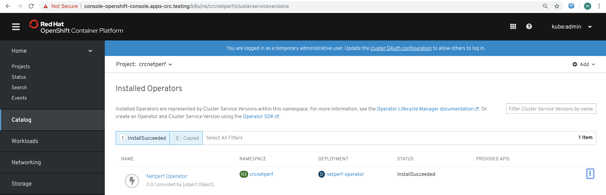

== Install Netperf Operator on CodeReady Containers / OpenShift 4.1

Let's deploy a simple (but awesome) netperf operator from https://github.com/piontec/netperf-operator

See also Lukasz Piatkowski's blog at https://www.tailored.cloud/kubernetes/write-a-kubernetes-controller-operator-sdk/

There are many great quick starts for OpenShift 4.1; I chose to deploy netperf on CodeReady Containers for its simplicity.

----
eval $(crc oc-env) && oc login -u kubeadmin -p <password> https://api.crc.testing:6443
----

----
oc new-project  crcnetperf

su demouser

cd /home/demouser
----

----
mkdir $GOPATH/src/github.com/crcnetperf

cd $GOPATH/src/github.com/crcnetperf

git clone https://github.com/piontec/netperf-operator.git

cd netperf-operator

dep ensure
----

----

export IMAGE=quay.io/marcf5/netperf-operator:v0.0.1

mv Dockerfile Dockerfile.bak

wget https://raw.githubusercontent.com/marcredhat/crcdemos/master/fedora/Dockerfile.latest

mv Dockerfile.latest Dockerfile

sudo podman login quay.io

sudo buildah bud  -t local/netperf .

sudo podman push local/netperf quay.io/marcf5/netperf
----

----
#Deploy the CRD and RBAC definition for the controller and a Deployment that will run it:
cd netperf-operator

oc create -f deploy/crd.yaml

oc create -f deploy/rbac.yaml

#Create pull secret for your quay.io repository
oc create secret docker-registry staging-secret \
    --docker-server=quay.io \
    --docker-username=<username> \
    --docker-password=<password> \
    --docker-email=<email> \
    --dry-run -o yaml > secret.yaml
    
oc create -f secret.yaml

#Edit deploy/operator.yaml to use quay.io/repository/marcf5/netperf and add the pull secret created above
#See mine at https://raw.githubusercontent.com/marcredhat/crcdemos/master/fedora/operator.yaml

cd deploy 

mv operator.yaml operator.yaml.bak

wget https://raw.githubusercontent.com/marcredhat/crcdemos/master/fedora/operator.yaml

oc create -f operator.yaml
----

[demouser@fedora30 netperf-operator]$ oc get pods

----
NAME                               READY   STATUS    RESTARTS   AGE
netperf-operator-c9c6f5b6b-npv6p   1/1     Running   0          14s
----

[demouser@fedora30 deploy]$ oc describe pod | grep quay

----
    Image:         quay.io/marcf5/netperf
    Image ID:      quay.io/marcf5/netperf@sha256:2ca2159c990b4cb2e47a6be8fc114beee02b52bd86f092e3490ae670232d7964
  Normal  Pulling    20m   kubelet, crc-56mmj-master-0  Pulling image "quay.io/marcf5/netperf"
  Normal  Pulled     20m   kubelet, crc-56mmj-master-0  Successfully pulled image "quay.io/marcf5/netperf"
----

----
#The Operator Lifecycle Manager will not watch this namespace because it is not configured with an OperatorGroup. 
#Create an OperatorGroup that specifies the namespaces that the Operator will target.
cat <<EOF | oc apply -f -
apiVersion: operators.coreos.com/v1
kind: OperatorGroup
metadata:
  name: netperf-operator
  namespace: crcnetperf
spec:
  targetNamespaces:
  - crcnetperf
EOF
----

----
#Create the a Netperf custom resource; this will create netperf client and server pods

cat <<EOF | oc apply -f -
apiVersion: "app.example.com/v1alpha1"
kind: "Netperf"
metadata:
  name: "crcexample"
spec:
  serverNode:
  clientNode:
EOF
----

[demouser@fedora30 deploy]$ oc describe Netperf crcexample

----
Name:         crcexample
Namespace:    crcnetperf
....
Status:
  Client Pod:          netperf-client-52fdfc072182
  Server Pod:          netperf-server-52fdfc072182
  Speed Bits Per Sec:  2959.27
  Status:              Done
----

----
[demouser@fedora30 netperf-operator]$ oc get pods
NAME                               READY   STATUS    RESTARTS   AGE
netperf-client-52fdfc072182        1/1     Running   0          18s
netperf-operator-c9c6f5b6b-dj8f8   1/1     Running   0          11m
netperf-server-52fdfc072182        1/1     Running   0          29s
----

----
[demouser@fedora30 netperf-operator]$ oc debug netperf-client-52fdfc072182
Starting pod/netperf-client-52fdfc072182-debug, command was: netperf -H 10.128.0.252

Pod IP: 10.128.0.254
If you don't see a command prompt, try pressing enter.
~
~ $ netperf -H 10.128.0.252
MIGRATED TCP STREAM TEST from 0.0.0.0 (0.0.0.0) port 0 AF_INET to 10.128.0.252 (10.128.) port 0 AF_INET

Recv   Send    Send
Socket Socket  Message  Elapsed
Size   Size    Size     Time     Throughput
bytes  bytes   bytes    secs.    10^6bits/sec

 87380  16384  16384    10.00    3399.19
~ $
----

== Make the Netperf Operator available in the OpenShift Operator Catalog

A ClusterServiceVersion (CSV) is a YAML manifest created from Operator metadata that assists the Operator Lifecycle Manager (OLM) in running the Operator in a cluster. It is the metadata that accompanies an Operator container image, used to populate user interfaces with information like its logo, description, and version. It is also a source of technical information needed to run the Operator, like the RBAC rules it requires and which Custom Resources (CRs) it manages or depends on.

See more at https://docs.openshift.com/container-platform/4.1/applications/operators/olm-understanding-olm.html#olm-csv_olm-understanding-olm

----
cd $GOPATH/src/github.com/crcnetperf/netperf-operator
cp deploy/rbac.yaml deploy/role.yaml
cd deploy/
mkdir crds
cp *.yaml crds/
cd ..
cp deploy/crds/rbac.yaml deploy/crds/role.yaml
cp deploy/rbac.yaml deploy/role.yaml
----

----
oc create sa netperf-operator
oc policy add-role-to-user cluster-admin -z netperf-operator
----

[demouser@fedora30 netperf-operator]$ operator-sdk olm-catalog gen-csv --csv-version 0.0.1
----
INFO[0000] Generating CSV manifest version 0.0.1
.....
INFO[0000] Created deploy/olm-catalog/netperf-operator/0.0.1/netperf-operator.v0.0.1.clusterserviceversion.yaml
INFO[0000] Created deploy/olm-catalog/netperf-operator/netperf-operator.package.yaml
----

#Replace "placeholder" with your namespace (crcnetperf in this example) in
#deploy/olm-catalog/netperf-operator/0.0.1/netperf-operator.v0.0.1.clusterserviceversion.yaml

#Make sure you don't have other operatorgroups in the same project.

----
oc apply -f deploy/olm-catalog/netperf-operator/0.0.1/netperf-operator.v0.0.1.clusterserviceversion.yaml
----

 

Other references:
https://docs.openshift.com/container-platform/4.1/applications/operator_sdk/osdk-getting-started.html#building-memcached-operator-using-osdk_osdk-getting-started
