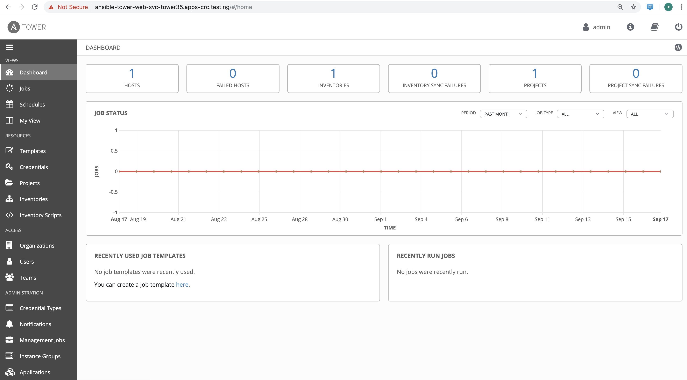

== Install Ansible Tower 3.5.2 on CodeReady Containers (CRC) / OpenShift 4.1

I’m running CRC on RHEL 8.1 or Fedora 30 *physical* servers, using SSH tunneling/port forwarding to connect from my laptop to the OpenShift console and deployed apps.

For step-by-step instructions and videos on installing CRC and various solutions on top of CRC, please see

----
bit.ly/marcredhat
bit.ly/marcredhatplaylist
----

----
eval $(crc oc-env) && oc login -u kubeadmin -p <password> https://api.crc.testing:6443
----

----
oc new-project tower35
----

cat postgres-nfs-pvc

----
kind: PersistentVolumeClaim
apiVersion: v1
metadata:
  name: postgresql
spec:
  accessModes:
    - ReadWriteOnce
  resources:
    requests:
      storage: 10Gi
----

----
oc create -f postgres-nfs-pvc
----

oc get pvc

----
NAME         STATUS   VOLUME   CAPACITY   ACCESS MODES   STORAGECLASS   AGE
postgresql   Bound    pv0020   10Gi       RWO,ROX,RWX                   34s
----

----
wget https://releases.ansible.com/ansible-tower/setup_openshift/ansible-tower-openshift-setup-3.5.2.tar.gz
tar -xvzf ansible-tower-openshift-setup-3.5.2.tar.gz
cd ansible-tower-openshift-setup-3.5.2
----

----
podman pull registry.access.redhat.com/ansible-tower-35/ansible-tower:3.5.2
podman pull registry.access.redhat.com/ansible-tower-35/ansible-tower-messaging:3.7.4
podman pull registry.access.redhat.com/ansible-tower-35/ansible-tower-memcached:latest
podman pull registry.access.redhat.com/rhscl/postgresql-96-rhel7
----

----
./setup_openshift.sh -e openshift_host=https://api.crc.testing:6443 -e openshift_project=tower35 -e openshift_user=kubeadmin -e openshift_password=<password>  -e admin_password=admin -e secret_key=mysecret -e pg_username=postgresuser -e pg_password=postgrespwd -e rabbitmq_password=rabbitpwd -e rabbitmq_erlang_cookie=rabbiterlangpwd -e openshift_skip_tls_verify=True
----

On your laptop,  add ansible-tower-web-svc-tower35.apps-crc.testing to /etc/hosts, pointing to 127.0.0.1.

Then, 

----
sudo ssh root@<CRC server> -L 443:console-openshift-console.apps-crc.testing:443
----

Browse to https://ansible-tower-web-svc-tower35.apps-crc.testing

