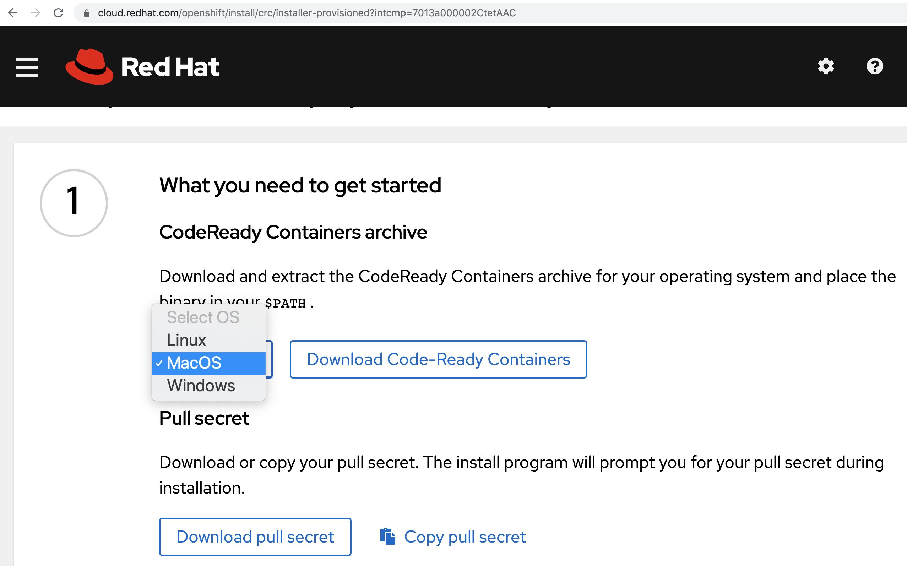
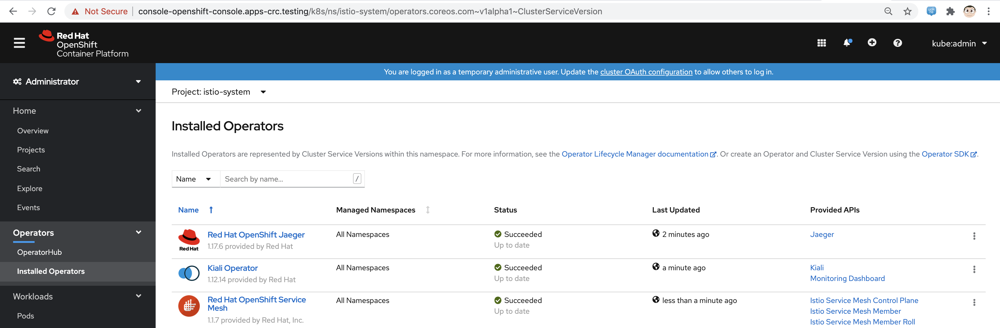
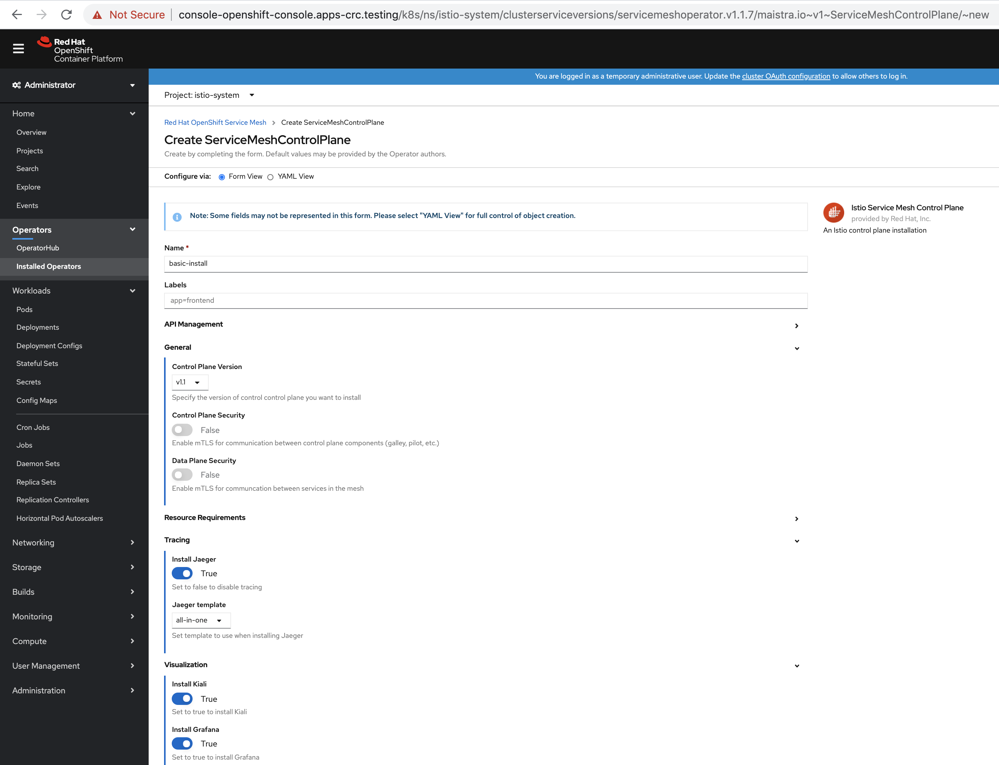
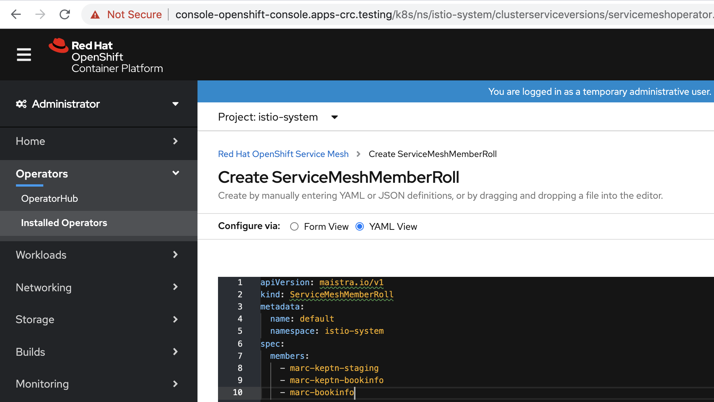

== Deploy OpenShift 4.5, Service Mesh and Keptn on your laptop or virtual machine using CodeReady Containers 

----
tar -xvzf crc-macos-amd64.tar.xz
sudo cp /Users/marcchisinevski/crc/crc-macos-1.14.0-amd64/crc /usr/local/bin
----

----
crc config set memory 16000
----

----
crc setup
INFO Checking if oc binary is cached
INFO Caching oc binary
INFO Checking if podman remote binary is cached
INFO Checking if goodhosts binary is cached
INFO Caching goodhosts binary
INFO Will use root access: change ownership of /Users/marcchisinevski/.crc/bin/goodhosts
INFO Will use root access: set suid for /Users/marcchisinevski/.crc/bin/goodhosts
INFO Checking if CRC bundle is cached in '$HOME/.crc'
INFO Unpacking bundle from the CRC binary
INFO Checking minimum RAM requirements
INFO Checking if running as non-root
INFO Checking if HyperKit is installed
INFO Setting up virtualization with HyperKit
INFO Will use root access: change ownership of /Users/marcchisinevski/.crc/bin/hyperkit
INFO Will use root access: set suid for /Users/marcchisinevski/.crc/bin/hyperkit
INFO Checking if crc-driver-hyperkit is installed
INFO Installing crc-machine-hyperkit
INFO Will use root access: change ownership of /Users/marcchisinevski/.crc/bin/crc-driver-hyperkit
INFO Will use root access: set suid for /Users/marcchisinevski/.crc/bin/crc-driver-hyperkit
INFO Checking file permissions for /etc/hosts
INFO Checking file permissions for /etc/resolver/testing
INFO Setting file permissions for /etc/resolver/testing
INFO Will use root access: create dir /etc/resolver
INFO Will use root access: create file /etc/resolver/testing
INFO Will use root access: change ownership of /etc/resolver/testing
Setup is complete, you can now run 'crc start' to start the OpenShift cluster
----

----
crc start
INFO Checking if oc binary is cached
INFO Checking if podman remote binary is cached
INFO Checking if goodhosts binary is cached
INFO Checking minimum RAM requirements
INFO Checking if running as non-root
INFO Checking if HyperKit is installed
INFO Checking if crc-driver-hyperkit is installed
INFO Checking file permissions for /etc/hosts
INFO Checking file permissions for /etc/resolver/testing
? Image pull secret [? for help] ************************************************************************************************************************************************************************************************************************************************************************************************************************************************************************************************************************************************************************************INFO Extracting bundle: crc_hyperkit_4.5.4.crcbundle ... **************************************************************************************************************crc.qcow2: 924.94 MiB / 9.90 GiB [
....

INFO To access the cluster, first set up your environment by following 'crc oc-env' instructions
INFO Then you can access it by running 'oc login -u developer -p developer https://api.crc.testing:6443'
INFO To login as an admin, run 'oc login -u kubeadmin -p DhjTx-8gIJC-2h2tK-eksGY https://api.crc.testing:6443'
INFO
INFO You can now run 'crc console' and use these credentials to access the OpenShift web console
Started the OpenShift cluster
----

----
eval $(crc oc-env)
----

----
oc login -u kubeadmin -p DhjTx-8gIJC-2h2tK-eksGY https://api.crc.testing:6443
----

----
oc version
Client Version: 4.5.4
Server Version: 4.5.4
Kubernetes Version: v1.18.3+012b3ec
----

----
oc new-project istio-system
----

----
ServiceMeshMemberRoll: marc-keptn-staging, marc-keptn-production, marc-bookinfo
----

----
oc get pods -n istio-system
NAME                                    READY   STATUS    RESTARTS   AGE
istio-citadel-6f9b74b754-5w7tf          1/1     Running   0          5m26s
istio-egressgateway-64ffbdb8c8-l9ht4    1/1     Running   0          34s
istio-galley-7c6fb78655-gxjrr           1/1     Running   0          112s
istio-ingressgateway-6c77fdbbd4-xzwlb   1/1     Running   0          34s
istio-pilot-7bf87fc66c-xw4ff            2/2     Running   1          36s
istio-policy-55b9c86c8c-k674m           2/2     Running   0          79s
istio-telemetry-859854d88b-sthjq        2/2     Running   0          78s
jaeger-5fcbd7c59f-4m4t8                 2/2     Running   0          110s
prometheus-6864b4b755-lrnlt             2/2     Running   0          2m48s
----

----
oc new-project marc-bookinfo
git clone https://github.com/marcredhat/istio
#git clone https://github.com/istio/istio
cd istio/samples/bookinfo/platform/kube
oc project marc-bookinfo
oc create -f bookinfo.yaml
----

----
cd ../../networking
oc create -f bookinfo-gateway.yaml
----

----
oc create -f virtual-service-reviews-jason-v2-v3.yaml
----

----
export GATEWAY_URL=$(oc -n istio-system get route istio-ingressgateway -o jsonpath='{.spec.host}')
echo "GATEWAY_URL=$GATEWAY_URL"
GATEWAY_URL=istio-ingressgateway-istio-system.apps-crc.testing
----

----
oc get pods -n marc-bookinfo
NAME                              READY   STATUS              RESTARTS   AGE
details-v1-558b8b4b76-snv6v       1/1     Running   0          23m
productpage-v1-6987489c74-mhs77   1/1     Running   0          23m
ratings-v1-7dc98c7588-2nq57       1/1     Running   0          23m
reviews-v1-7f99cc4496-2hqsc       1/1     Running   0          23m
reviews-v2-7d79d5bd5d-xc9cz       1/1     Running   0          23m
reviews-v3-7dbcdcbc56-dk77f       1/1     Running   0          23m
----

----
Browse to http://$GATEWAY_URL/productpage
http://istio-ingressgateway-istio-system.apps-crc.testing/productpage
----

----
oc new-project keptn
curl -sL https://get.keptn.sh | sudo -E bash
keptn install --use-case=continuous-delivery --platform=openshift
----

----
oc get pvc
NAME                   STATUS   VOLUME   CAPACITY   ACCESS MODES   STORAGECLASS   AGE
configuration-volume   Bound    pv0003   100Gi      RWO,ROX,RWX                   18m
mongodata              Bound    pv0015   100Gi      RWO,ROX,RWX                   18m
----

----
oc get pods
NAME                                                              READY   STATUS    RESTARTS   AGE
api-gateway-nginx-5bc6f54d4b-kxdgh                                1/1     Running   0          33m
api-service-55d4c499fd-5s7hz                                      1/1     Running   0          33m
bridge-559f9988c7-qxtd2                                           1/1     Running   0          33m
configuration-service-865d89f78f-8v7lz                            2/2     Running   3          33m
eventbroker-go-dcf997974-kw765                                    1/1     Running   0          33m
gatekeeper-service-678f556955-rgdgp                               2/2     Running   4          33m
helm-service-6946fb9b8d-8kjqf                                     2/2     Running   3          33m
helm-service-continuous-deployment-distributor-567cc995bd-pzgsg   1/1     Running   3          33m
jmeter-service-669848d4f8-mccb6                                   2/2     Running   3          33m
keptn-nats-cluster-0                                              3/3     Running   0          33m
lighthouse-service-5bb8698f9-h4tpt                                2/2     Running   3          33m
mongodb-datastore-cd457f886-nw2bq                                 2/2     Running   2          33m
openshift-route-service-7f57d79955-7f8vn                          2/2     Running   3          33m
remediation-service-5f44c6779c-bx8pf                              2/2     Running   3          33m
shipyard-service-6c989977d5-8mxp9                                 2/2     Running   3          33m
----

----
oc login https://api.crc.testing:6443
kubeadmin
DhjTx-8gIJC-2h2tK-eksGY
----

----
KEPTN_ENDPOINT=http://api-gateway-nginx-keptn.apps-crc.testing/api
KEPTN_API_TOKEN=$(kubectl get secret keptn-api-token -n keptn -ojsonpath={.data.keptn-api-token} | base64 --decode)
echo $KEPTN_API_TOKEN
keptn auth --endpoint=$KEPTN_ENDPOINT --api-token=$KEPTN_API_TOKEN
keptn configure bridge --output
----

----
Create github repo and initialize with a README
----

----
keptn create project marc-keptn --shipyard ./shipyard.yaml --git-user=marcredhat --git-token=<git token> \
      --git-remote-url=https://github.com/marcredhat/marc-keptn.git

Starting to create project
ID of Keptn context: 7e2a5b2b-b3ac-4346-8663-583f48717911
Project marc-keptn created
Stage dev created
Stage staging created
Stage production created
Shipyard successfully processed
----

----
git clone https://github.com/keptn/examples.git
cd examples/onboarding-carts/
----

----
keptn onboard service carts --project=marc-keptn --chart=./carts
Starting to onboard service
ID of Keptn context: feb1b16d-7143-4610-b2ac-3821e2dc0e24
Create umbrella Helm Chart for project marc-keptn
Creating new Keptn service carts in stage dev
Creating new Keptn service carts in stage staging
----

----
oc expose svc api-gateway-nginx
route.route.openshift.io/api-gateway-nginx exposed

oc get route
NAME                HOST/PORT                                  PATH   SERVICES            PORT   TERMINATION   WILDCARD
api-gateway-nginx   api-gateway-nginx-keptn.apps-crc.testing          api-gateway-nginx   http                 None
----

----
oc apply -f https://raw.githubusercontent.com/keptn-contrib/dynatrace-service/0.8.0/deploy/service.yaml
----

----
We'll use the route we create above by exposing the api-gateway-nginx service.

oc -n keptn create secret generic dynatrace --from-literal="DT_API_TOKEN=<Dynatrace API token>" \
      --from-literal="DT_TENANT=eye15053.live.dynatrace.com" \
      --from-literal="KEPTN_API_URL=http://api-gateway-nginx-keptn.apps-crc.testing/api" \
      --from-literal="KEPTN_API_TOKEN=<Keptn API token>" -o yaml --dry-run=client | oc apply -f -
----

----
oc new-project dynatrace
kubectl apply -f https://raw.githubusercontent.com/keptn-contrib/dynatrace-service/0.8.0/deploy/service.yaml
----

----
keptn configure monitoring dynatrace --project=marc-keptn --service=carts --suppress-websocket
----

----
keptn send event new-artifact --project=marc-keptn --service=carts --image=docker.io/keptnexamples/carts --tag=0.11.2
Starting to send a new-artifact-event to deploy the service carts in project marc-keptn in version docker.io/keptnexamples/carts:0.11.2
ID of Keptn context: 43ee7e64-f15a-4a22-b6ef-2a73a4e3e439
Start updating chart carts of stage dev
Finished updating chart carts of stage dev
Start upgrading chart marc-keptn-dev-carts in namespace marc-keptn-dev
----

----
oc get pods -n marc-keptn-dev
NAME                   READY   STATUS    RESTARTS   AGE
carts-f64fc58f-8rznq   0/1     Running   0          2m10s

oc get svc -n marc-keptn-dev
NAME    TYPE        CLUSTER-IP       EXTERNAL-IP   PORT(S)   AGE
carts   ClusterIP   172.25.153.200   <none>        80/TCP    177m

oc expose svc  carts -n marc-keptn-dev
route.route.openshift.io/carts exposed

oc get route -n marc-keptn-dev
NAME    HOST/PORT                               PATH   SERVICES   PORT   TERMINATION   WILDCARD
carts   carts-marc-keptn-dev.apps-crc.testing          carts      http                 None
----

----
oc apply -f  https://raw.githubusercontent.com/keptn-contrib/dynatrace-sli-service/0.4.1/deploy/service.yaml
keptn add-resource --project=marc-keptn --stage=dev --service=carts --resource=./sli-config-dynatrace.yaml --resourceUri=dynatrace/sli.yaml
keptn add-resource --project=marc-keptn --stage=dev --service=carts --resource=./slo-quality-gates.yaml --resourceUri=slo.yaml
----

----
keptn send event start-evaluation --project=marc-keptn --stage=dev --service=carts --timeframe=2m
----

----
keptn get event evaluation-done --keptn-context=9c212870-0113-4399-ae65-ca7def5d1244
----

----
oc logs dynatrace-service-675bb59f6b-l9789
##########
branch: 0.8.0
repository: https://github.com/keptn-contrib/dynatrace-service
commitlink: https://github.com/keptn-contrib/dynatrace-service/commit/72d11a24357fd4d6529d9c8608b62a961698dd30
repolink: https://github.com/keptn-contrib/dynatrace-service/tree/72d11a24357fd4d6529d9c8608b62a961698dd30
timestamp: 20200723.1120
version: 0.8.0
##########
2020/08/21 04:31:18 Port = 8080; Path=/
{"timestamp":"2020-08-21T04:31:48.681738955Z","logLevel":"DEBUG","message":"Received event: sh.keptn.event.start-evaluation"}
{"timestamp":"2020-08-21T04:31:53.481618684Z","logLevel":"INFO","message":"Check if event of type sh.keptn.event.start-evaluation should be sent to Dynatrace."}
{"timestamp":"2020-08-21T04:31:53.482334705Z","logLevel":"INFO","message":"Ignoring event."}
{"timestamp":"2020-08-21T04:31:54.0818858Z","logLevel":"DEBUG","message":"Received event: sh.keptn.internal.event.get-sli"}
{"timestamp":"2020-08-21T04:31:54.486262178Z","logLevel":"INFO","message":"Check if event of type sh.keptn.internal.event.get-sli should be sent to Dynatrace."}
{"timestamp":"2020-08-21T04:31:54.486318382Z","logLevel":"INFO","message":"Ignoring event."}
----

----
oc get pods -n keptn
NAME                                                              READY   STATUS    RESTARTS   AGE
api-gateway-nginx-5bc6f54d4b-kxdgh                                1/1     Running   0          4h26m
api-service-55d4c499fd-5s7hz                                      1/1     Running   0          4h26m
bridge-559f9988c7-qxtd2                                           1/1     Running   0          4h26m
configuration-service-865d89f78f-8v7lz                            2/2     Running   3          4h26m
dynatrace-service-5c7c777bdb-pz46k                                1/1     Running   2          3m18s
dynatrace-service-distributor-56957bb598-k8plv                    1/1     Running   0          3h38m
dynatrace-sli-service-598584bf5d-jk2w8                            1/1     Running   0          2m26s
dynatrace-sli-service-monitoring-configure-distributor-7b84f5zg   1/1     Running   0          82s
eventbroker-go-dcf997974-kw765                                    1/1     Running   0          4h26m
gatekeeper-service-678f556955-rgdgp                               2/2     Running   4          4h26m
helm-service-6946fb9b8d-8kjqf                                     2/2     Running   3          4h26m
helm-service-continuous-deployment-distributor-567cc995bd-pzgsg   1/1     Running   3          4h26m
jmeter-service-669848d4f8-mccb6                                   2/2     Running   3          4h26m
keptn-nats-cluster-0                                              3/3     Running   0          4h26m
lighthouse-service-5bb8698f9-h4tpt                                2/2     Running   3          4h26m
mongodb-datastore-cd457f886-nw2bq                                 2/2     Running   2          4h26m
mongodb-dbff8b66c-wxrq6                                           1/1     Running   0          3h45m
openshift-route-service-7f57d79955-7f8vn                          2/2     Running   3          4h26m
remediation-service-5f44c6779c-bx8pf                              2/2     Running   3          4h26m
shipyard-service-6c989977d5-8mxp9                                 2/2     Running   3          4h26m
----

== Keptn bridge

----
Configure the bridge credentials
keptn configure bridge expose --user=<user> --password=<password>
----

----
oc port-forward svc/bridge -n keptn 9000:8080
----

Browse to http://localhost:9000/dashboard

----
kubectl set image deployment/mongodb mongodb=keptn/mongodb-privileged:latest -n keptn
keptn generate support-archive --dir=
----

== Cleanup
oc delete project keptn
oc delete ClusterRole keptn-keptn-securitycontextconstraints
oc delete ClusterRoleBinding keptn-keptn-securitycontextconstraints
oc delete ClusterRoleBinding keptn-keptn-helm-service-cluster-admin
