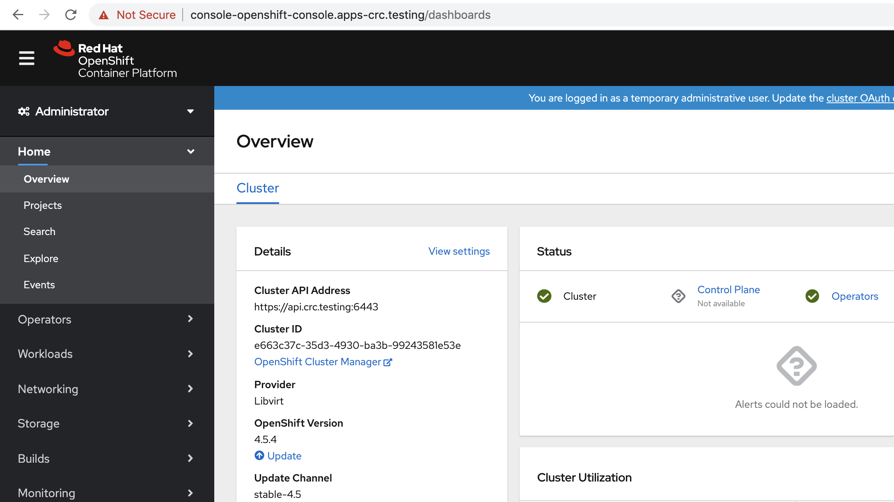
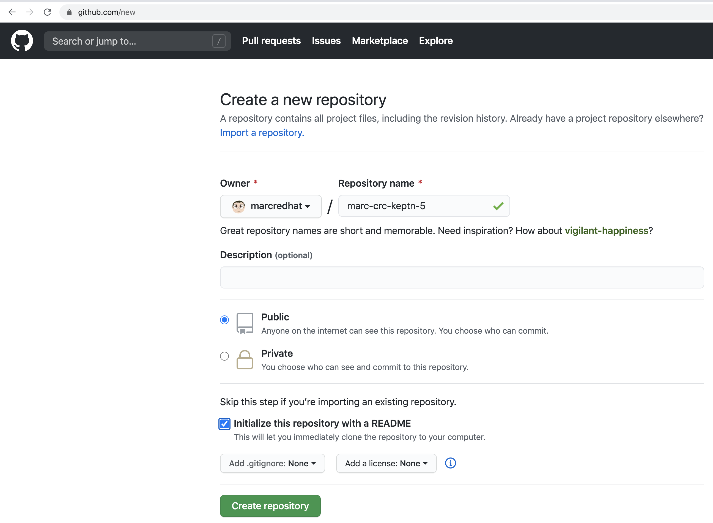
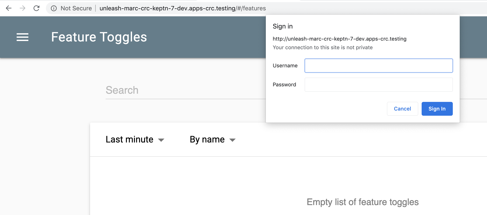
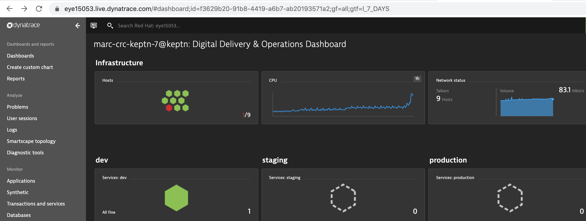
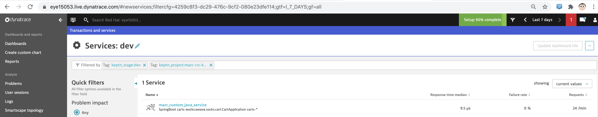
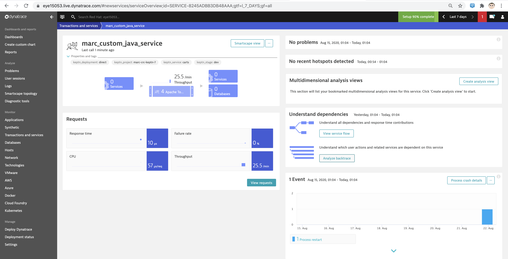
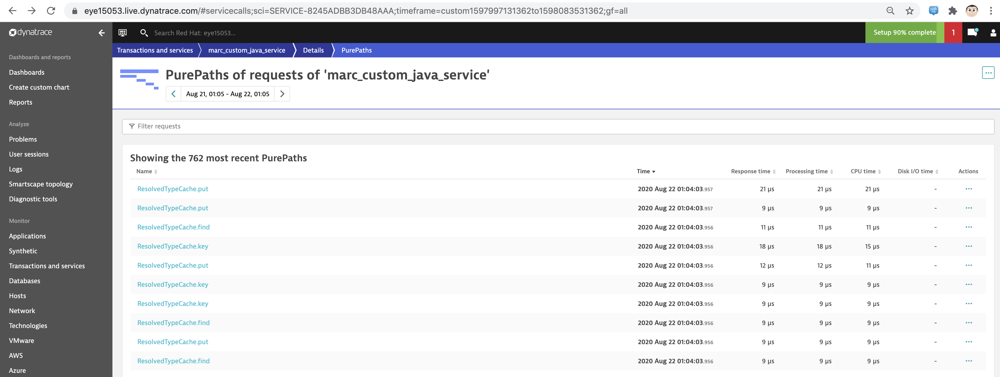
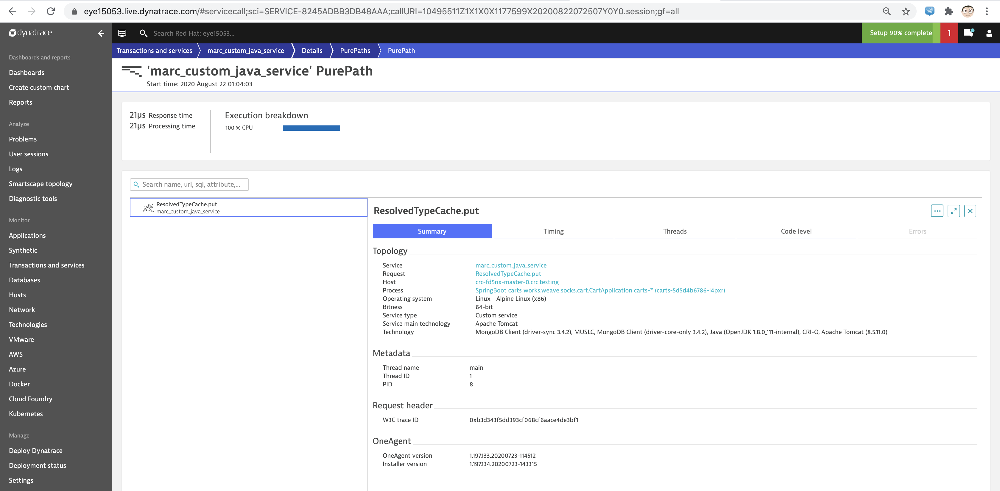

== Automated install of OpenShift 4.5, Service Mesh, Dynatrace OneAgent Operator and Keptn 
== on your laptop or virtual machine using CodeReady Containers

NOTE: You'll need 16GB of RAM. 

----
git clone https://github.com/marcredhat/crcdemos.git
cd crcdemos/keptn
sudo chmod +x ./*.sh
----

----
sudo ./cleanup.sh
----

----
From https://developers.redhat.com/products/codeready-containers/download:

1. Download CodeReady Containers in the current folder. I'm on a Mac so I'm using crc-macos-amd64.tar.xz.
   CodeReady Containers is also available for Linux and Windows.

2. Copy  your pull secret to the current folder in a file called pullsecret.txt
----

----
./crc.sh
----

----
This will install OpenShift 4.5, display the login info and open a browser window with the OpenShift console.
INFO To access the cluster, first set up your environment by following 'crc oc-env' instructions
INFO Then you can access it by running 'oc login -u developer -p developer https://api.crc.testing:6443'
INFO To login as an admin, run 'oc login -u kubeadmin -p DhjTx-8gIJC-2h2tK-eksGY https://api.crc.testing:6443'
INFO
INFO You can now run 'crc console' and use these credentials to access the OpenShift web console
Started the OpenShift cluster
WARN The cluster might report a degraded or error state. This is expected since several operators have been disabled to lower the resource usage. For more information, please consult the documentation
Opening the OpenShift Web Console in the default browser...
----

----
Login as kubeadmin with the password displayed by the previous command 
----

== Install OpenShift Service Mesh

NOTE: The script below will:

      1. Install Kiali, Jaeger and Service Mesh Operators
      
      2. Deploy the Service Mesh control plane in istio-system.
      
      3. Create the Service Mesh member roll. 

----
The ServiceMeshMemberRoll lists the projects belonging to the control plane. 
Only projects listed in the ServiceMeshMemberRoll are affected by the control plane. 
A project does not belong to a service mesh until you add it to the member roll for a particular control plane deployment.

So you'll want to edit the ServiceMeshMemberRoll.
----

The ServiceMeshMemberRoll created by the script below can be found at:
https://github.com/marcredhat/crcdemos/blob/master/keptn/meshmemberroll.yaml

NOTE: Keptn requires OpenShift Service Mesh for doing a blue/green deployment.  
      
      Two CRDs are required: DestinationRule and VirtualService
      
NOTE: With OpenShift Service Mesh, you can have multiple control planes each managing multiple namespaces.
      However, Keptn expects Service Mesh to be deployed in istio-system.
      
      So, we'll deploy OpenShift Service Mesh in the istio-system project.

----
./mesh1.sh
----

----
....
operatorgroup.operators.coreos.com/global-operators created
subscription.operators.coreos.com/jaeger-product created
subscription.operators.coreos.com/kiali-ossm created
subscription.operators.coreos.com/servicemeshoperator created
servicemeshcontrolplane.maistra.io/basic-install created
servicemeshmemberroll.maistra.io/default created
No resources found in istio-system namespace.
----

----
oc get pods
NAME                                      READY   STATUS    RESTARTS   AGE
grafana-6787dc695-b9srg                   2/2     Running   0          56s
istio-citadel-6f9b74b754-2npp9            1/1     Running   0          3m43s
istio-egressgateway-64ffbdb8c8-kbqbl      1/1     Running   0          91s
istio-galley-7c6fb78655-ntbd2             1/1     Running   0          2m31s
istio-ingressgateway-6c77fdbbd4-hxtch     1/1     Running   0          90s
istio-pilot-7bf87fc66c-h5kmd              2/2     Running   0          109s
istio-policy-55b9c86c8c-24szc             2/2     Running   0          2m16s
istio-sidecar-injector-66fd9459d9-2qk5s   1/1     Running   0          83s
istio-telemetry-859854d88b-2p9tb          2/2     Running   0          2m15s
jaeger-64d858c8c5-44cfj                   2/2     Running   0          2m30s
prometheus-6864b4b755-tk7q2               2/2     Running   0          3m24s
----

== Deploy the BookInfo app to validate that we have a fully functional Service Mesh

NOTE: The upstream Istio community installation automatically injects the sidecar into pods within the projects you have labeled.

NOTE: Red Hat OpenShift Service Mesh does not automatically inject the sidecar to any pods, but 
      requires you to specify the sidecar.istio.io/inject annotation as illustrated in the Automatic sidecar injection section.
      
The script below uses https://github.com/marcredhat/crcdemos/blob/master/keptn/productpageinject.yaml
which includes
----
annotations:
      sidecar.istio.io/inject: "true"
      
so that OpenShift Service Mesh injects the sidecar into the productpage pods      
----

----
./deploybookinfo.sh
----

----
Already on project "marc-bookinfo" on server "https://api.crc.testing:6443".
service/details created
serviceaccount/bookinfo-details created
deployment.apps/details-v1 created
service/ratings created
serviceaccount/bookinfo-ratings created
deployment.apps/ratings-v1 created
service/reviews created
serviceaccount/bookinfo-reviews created
deployment.apps/reviews-v1 created
deployment.apps/reviews-v2 created
deployment.apps/reviews-v3 created
service/productpage created
serviceaccount/bookinfo-productpage created
deployment.apps/productpage-v1 created
deployment.apps "productpage-v1" deleted
deployment.apps/productpage-v1 created

gateway.networking.istio.io/bookinfo-gateway created
virtualservice.networking.istio.io/bookinfo created
virtualservice.networking.istio.io/reviews created
GATEWAY_URL=istio-ingressgateway-istio-system.apps-crc.testing
NAME                              READY   STATUS              RESTARTS   AGE
details-v1-558b8b4b76-6zg28       0/1     ContainerCreating   0          43s
productpage-v1-5d68f47ff4-hpzd2   0/2     ContainerCreating   0          11s
ratings-v1-7dc98c7588-7hbzr       0/1     ContainerCreating   0          43s
reviews-v1-7f99cc4496-9lqqd       0/1     ContainerCreating   0          43s
reviews-v2-7d79d5bd5d-f45pv       0/1     ContainerCreating   0          43s
reviews-v3-7dbcdcbc56-5stlz       0/1     ContainerCreating   0          44s
----

----
Wait until all pods are ready:
oc get pods
NAME                              READY   STATUS    RESTARTS   AGE
details-v1-558b8b4b76-6zg28       1/1     Running   0          4m41s
productpage-v1-5d68f47ff4-hpzd2   2/2     Running   0          4m9s
ratings-v1-7dc98c7588-7hbzr       1/1     Running   0          4m41s
reviews-v1-7f99cc4496-9lqqd       1/1     Running   0          4m41s
reviews-v2-7d79d5bd5d-f45pv       1/1     Running   0          4m41s
reviews-v3-7dbcdcbc56-5stlz       1/1     Running   0          4m42s
----

----
The BookInfo app is now deployed on OpenShift Service Mesh. 

All running on CodeReady Containers on my laptop.
----

Browse to http://istio-ingressgateway-istio-system.apps-crc.testing/productpage

 

== Deploy Dynatrace OneAgent Operator 

----
Add your Dynatrace tenant, API and PAAS token to ./deployoneagent.sh and run it 
----

----
./deployoneagent.sh 
----

----
oc get pods
NAME                                          READY   STATUS    RESTARTS   AGE
dynatrace-oneagent-operator-b6bf98cfd-rd8dd   1/1     Running   0          3m49s
dynatrace-oneagent-webhook-67b79d8b7f-qjmls   2/2     Running   0          3m49s
oneagent-7s7jm                                0/1     Running   0          58s
----

----
Check the OneAgent logs
----

----
oc logs oneagent-7s7jm
----

----
....
00:15:54 User 'dtuser' added successfully.
00:16:02 Non-privileged mode is enabled.
00:16:02 Storing SELinux policy sources in /opt/dynatrace/oneagent/agent.
00:16:02 Installing SELinux Dynatrace module. This may take a while...
00:16:51 dynatrace_oneagent module was successfully installed
----

== Install Keptn

----
./deploykeptn.sh
----

----
Moving keptn binary to /usr/local/bin/keptn
Keptn is now ready
Helm Chart used for Keptn installation: https://storage.googleapis.com/keptn-installer/keptn-0.7.0.tgz
Installing Keptn ...
Please enter the following information or press enter to keep the old value:
Openshift Server URL [https://api.crc.testing:6443]:
Openshift User [kubeadmin]:
Openshift Password [DhjTx-8gIJC-2h2tK-eksGY]:

Please confirm that the provided cluster information is correct:
Openshift Server URL: https://api.crc.testing:6443
Openshift User: kubeadmin

Is this all correct? (y/n)
y
Existing Keptn installation found in namespace keptn

Do you want to overwrite this installation? (y/n)
y
Start upgrading Helm Chart keptn in namespace: keptn
....
----

----
oc get pods
NAME                                                              READY   STATUS    RESTARTS   AGE
api-gateway-nginx-5bc6f54d4b-p7d6b                                1/1     Running   0          10m
api-service-55d4c499fd-smdcr                                      1/1     Running   0          10m
bridge-559f9988c7-qmvmr                                           1/1     Running   0          10m
configuration-service-865d89f78f-c5h6n                            2/2     Running   2          10m
eventbroker-go-dcf997974-46v75                                    1/1     Running   0          10m
gatekeeper-service-678f556955-fr28n                               2/2     Running   2          10m
helm-service-6946fb9b8d-nvqnh                                     2/2     Running   3          10m
helm-service-continuous-deployment-distributor-567cc995bd-5gfgc   1/1     Running   3          10m
jmeter-service-669848d4f8-jkj44                                   2/2     Running   2          10m
keptn-nats-cluster-0                                              3/3     Running   0          9m59s
lighthouse-service-5bb8698f9-fbz25                                2/2     Running   3          10m
mongodb-datastore-cd457f886-27z6w                                 2/2     Running   2          10m
openshift-route-service-7f57d79955-p75qf                          2/2     Running   3          10m
remediation-service-5f44c6779c-2hc5s                              2/2     Running   2          10m
shipyard-service-6c989977d5-wfsfp                                 2/2     Running   2          10m
----

== Configure Keptn

----
./configurekeptn.sh
Starting to authenticate
Successfully authenticated
user: keptn
password: hKegdDbWwfOYch6c
Bridge credentials configured successfully
Forwarding from 127.0.0.1:9000 -> 3000
Forwarding from [::1]:9000 -> 3000
----

== Configure Dynatrace monitoring for our to-be-deployed Keptn project

----
./configuredynatrace.sh
Now using project "keptn" on server "https://api.crc.testing:6443".
secret/dynatrace configured
Now using project "dynatrace" on server "https://api.crc.testing:6443".
serviceaccount/keptn-dynatrace-service unchanged
role.rbac.authorization.k8s.io/keptn-dynatrace-service-secrets unchanged
role.rbac.authorization.k8s.io/keptn-dynatrace-service-namespace unchanged
rolebinding.rbac.authorization.k8s.io/keptn-dynatrace-service-namespace unchanged
rolebinding.rbac.authorization.k8s.io/keptn-dynatrace-service-secrets unchanged
deployment.apps/dynatrace-service unchanged
service/dynatrace-service unchanged
deployment.apps/dynatrace-service-distributor unchanged
ID of Keptn context: 7010c0b4-0a0d-47cc-a40f-175e2664b932
----

== Deploy using Keptn

NOTE: I encountered a situation where the limits set in https://github.com/marcredhat/crcdemos/blob/master/keptn/deploykeptn.sh
      were not enough for Keptn's api-gateway-nginx pod to run properly.
      
      
----
So I increased them as follows:

for deploy in `oc get deploy -n keptn |awk '{ print $1 }'`
do
  oc -n keptn set resources deployment $deploy  --limits=cpu=30m,memory=128Mi --requests=cpu=30m,memory=64Mi
done
oc delete pods --all -n keptn
----

----
Create a github repo and initialize it with a README file 
----

----
./deployusingkeptn.sh
24p4v4ClxeEGUXmJ6nhE
Starting to authenticate
Successfully authenticated
Starting to authenticate
Successfully authenticated
CLI is authenticated against the Keptn cluster http://api-gateway-nginx-keptn.apps-crc.testing/api
Cloning into 'examples'...
remote: Enumerating objects: 43, done.
remote: Counting objects: 100% (43/43), done.
remote: Compressing objects: 100% (31/31), done.
remote: Total 1515 (delta 17), reused 23 (delta 8), pack-reused 1472
Receiving objects: 100% (1515/1515), 40.86 MiB | 4.28 MiB/s, done.
Resolving deltas: 100% (776/776), done.
Starting to create project
ID of Keptn context: 9c6d1c7d-36ba-422d-a080-9891f03545c2
....
----

----
keptn create project marc-crc-keptn-7 --shipyard ./shipyard.yaml --git-user=marcredhat --git-token=$GIT_TOKEN --git-remote-url=https://github.com/marcredhat/marc-crc-keptn-7.git
Starting to create project
ID of Keptn context: ebe431f7-0b11-482f-a7c4-530304f7ba0a
Project marc-crc-keptn-7 created
Stage dev created
Stage staging created
Stage production created
Shipyard successfully processed
----

----
keptn onboard service carts --project=marc-crc-keptn-7 --chart=./carts
Starting to onboard service
ID of Keptn context: caa2d461-446e-46f4-9b8b-8dbdd57d3138
Create umbrella Helm Chart for project marc-crc-keptn-7
Creating new Keptn service carts in stage dev
Creating new Keptn service carts in stage staging
Inject Istio to the marc-crc-keptn-7-staging namespace for blue-green deployments
Creating new Keptn service carts in stage production
Inject Istio to the marc-crc-keptn-7-production namespace for blue-green deployments
Finished creating service carts in project marc-crc-keptn-7
----

----
keptn onboard service carts-db --project=marc-crc-keptn-7 --chart=./carts-db
Starting to onboard service
ID of Keptn context: 36c053dc-e4fa-47a2-9d50-cb2718b16a69
Creating new Keptn service carts-db in stage dev

Creating new Keptn service carts-db in stage staging
Inject Istio to the marc-crc-keptn-7-staging namespace for blue-green deployments
Creating new Keptn service carts-db in stage production
Inject Istio to the marc-crc-keptn-7-production namespace for blue-green deployments
Finished creating service carts-db in project marc-crc-keptn-7
----

----
keptn send event new-artifact --project=marc-crc-keptn-7 --service=carts --image=docker.io/keptnexamples/carts --tag=0.11.2
----

----
keptn send event new-artifact --project=marc-crc-keptn-7 --service=carts-db --image=docker.io/mongo --tag=4.2.2
Starting to send a new-artifact-event to deploy the service carts-db in project marc-crc-keptn-7 in version docker.io/mongo:4.2.2
ID of Keptn context: 78f7ab92-de64-4963-8a42-fa97f9201bc7
Start updating chart carts-db of stage dev
Finished updating chart carts-db of stage dev
Start upgrading chart marc-crc-keptn-7-dev-carts-db in namespace marc-crc-keptn-7-dev
----

== Onboard unleash and unleash-db

----
cd ../unleash-server
----

----
keptn onboard service unleash-db --project=marc-crc-keptn-7  --chart=./unleash-db
Starting to onboard service
ID of Keptn context: 62859441-86c4-4c6c-a108-ad9b5e445eb8
Creating new Keptn service unleash-db in stage dev
Creating new Keptn service unleash-db in stage staging
Inject Istio to the marc-crc-keptn-7-staging namespace for blue-green deployments
Creating new Keptn service unleash-db in stage production
Inject Istio to the marc-crc-keptn-7-production namespace for blue-green deployments
Finished creating service unleash-db in project marc-crc-keptn-7
----

----
keptn onboard service unleash --project=marc-crc-keptn-7  --chart=./unleash
Starting to onboard service
ID of Keptn context: 44586416-cdc6-460f-babf-84f0c228ea94
Creating new Keptn service unleash in stage dev
Service already exists
----

----
keptn send event new-artifact --project=marc-crc-keptn-7 --service=unleash-db --image=postgres:10.4
keptn send event new-artifact --project=marc-crc-keptn-7 --service=unleash --image=docker.io/keptnexamples/unleash:1.0.0
----

----
keptn send event start-evaluation --project=marc-crc-keptn-7  --stage=dev --service=unleash --timeframe=2m
keptn get event evaluation-done --keptn-context=9c212870-0113-4399-ae65-ca7def5d1244
----

----
oc get pods -n marc-crc-keptn-7-dev
NAME                       READY   STATUS              RESTARTS   AGE
carts-56cff87fb7-7fxts     0/1     ContainerCreating   0          3m2s
unleash-6f7794f8b4-6svbz   1/1     Running             2          11m
----

----
oc get svc  -n marc-crc-keptn-7-dev
NAME      TYPE        CLUSTER-IP       EXTERNAL-IP   PORT(S)        AGE
carts     ClusterIP   172.25.218.5     <none>        80/TCP         45m
unleash   NodePort    172.25.180.123   <none>        80:31719/TCP   14m

oc expose svc carts -n marc-crc-keptn-7-dev
route.route.openshift.io/carts exposed

oc get route   -n marc-crc-keptn-7-dev
NAME    HOST/PORT                                     PATH   SERVICES   PORT   TERMINATION   WILDCARD
carts   carts-marc-crc-keptn-7-dev.apps-crc.testing          carts      http                 None
----

Browse to http://carts-marc-crc-keptn-7-dev.apps-crc.testing

----
oc expose svc unleash -n marc-crc-keptn-7-dev
route.route.openshift.io/unleash exposed
----

----
oc get route -n marc-crc-keptn-7-dev
NAME      HOST/PORT                                       PATH   SERVICES   PORT        TERMINATION   WILDCARD
carts     carts-marc-crc-keptn-7-dev.apps-crc.testing            carts      http                      None
unleash   unleash-marc-crc-keptn-7-dev.apps-crc.testing          unleash    http-port                 None
----

Browse to http://unleash-marc-crc-keptn-7-dev.apps-crc.testing 

----
You might need to tweak the limits and requests for the carts and unleash deployments.

Here is what worked for me:
----

https://github.com/marcredhat/crcdemos/blob/master/keptn/carts_and_unleash_deployments.yaml

== Dynatrace dashboard for projects deployed by Keptn

----
Click on "Services:dev"
----

----
Click on the service for our "carts" SpringBoot app 
----

----
Click on "Analyze backtrace"
----

----
Under "Actions", click on "PurePaths"
Select a PurePath then click on its name 
----

