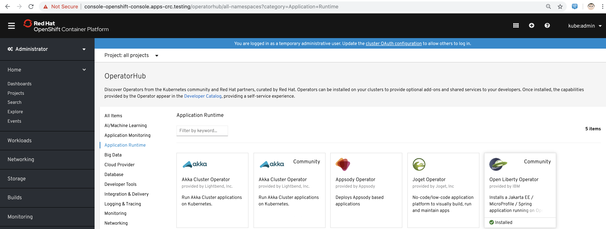
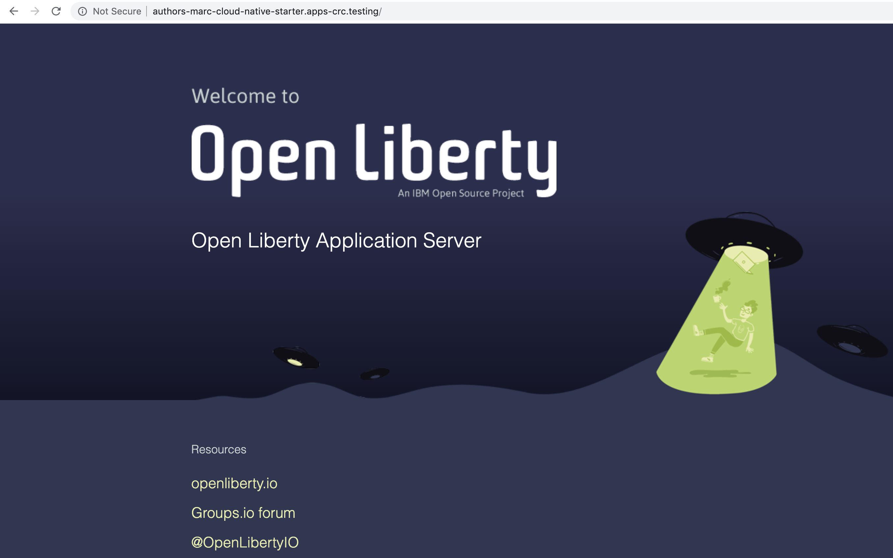

== Deploy SpringBoot and Jakarta EE apps with Open Liberty on OpenShift 4.2+ / CodeReady Containers

Credits: https://github.com/IBM/cloud-native-starter

This is a step-by-step guide to deploy `SpringBoot` and `Jakarta EE` apps on OpenShift 4.2+ / CodeReady Containers / Open Liberty.

Open Liberty is a lightweight, production-ready Java runtime for containerizing and deploying microservices to the cloud, and is now available as part of a Red Hat Runtimes subscription. If you are a Red Hat Runtimes subscriber, you can write your Eclipse MicroProfile and Jakarta EE apps on Open Liberty and then run them in containers on Red Hat OpenShift, with commercial support from Red Hat and IBM.

(Source: See https://developers.redhat.com/blog/2019/11/14/open-liberty-java-runtime-now-available-to-red-hat-runtimes-subscribers/)

The Jakarta EE 8 has the same set of specifications from Java EE 8 with no changes in its features. The only change is the new process to evolve these specifications. With this, Jakarta EE 8 is a milestone in Java enterprise history, as it inserts these specifications in a new process to boost the specifications to a cloud-native application approach.

(Source: https://developers.redhat.com/blog/2019/09/12/jakarta-ee-8-the-new-era-of-java-ee-explained/)

The OperatorHub in OpenShift 4.2 includes the Open Liberty Community Operator, which install Jakarta EE / MicroProfile / Spring applications.

== Deploying a Jakarta EE app on OpenShift 4.2 / CodeReady Containers / Open Liberty

----
[demouser@rhel8 authors-java-jee]$ oc version && crc version
Client Version: v4.3.0
Server Version: 4.2.2
Kubernetes Version: v1.14.6+868bc38
crc version: 1.1.0+95966a9
OpenShift version: 4.2.2 (embedded in binary)
----

----
oc login -u kubeadmin -p <password> https://api.crc.testing:6443
----

----
oc new-project marc-cloud-native-starter
----

----
git clone https://github.com/marcredhat/cloud-native-starter.git
cd cloud-native-starter/authors-java-jee
----

----
buildah bud -t authors .
----

----
[demouser@rhel8 authors-java-jee]$ podman images
REPOSITORY                        TAG              IMAGE ID       CREATED         SIZE
localhost/authors                 latest           6d3bc1fe3a3e   2 minutes ago   401 MB
----

----
podman  login -u="marcf5" -p="<token>" quay.io
----

----
podman push localhost/authors quay.io/marcf5/authors
----

----
oc create secret docker-registry staging-secret     --docker-server=quay.io     --docker-username=<email>  --docker-password=<password>     --docker-email=<email>     --dry-run -o yaml > staging-secret.yaml
----

----
oc create -f ./staging-secret.yaml
----

----
oc apply -f https://raw.githubusercontent.com/marcredhat/cloud-native-starter/master/authors-java-jee/deployment/deployment-os.yaml
oc apply -f https://raw.githubusercontent.com/marcredhat/cloud-native-starter/master/authors-java-jee/deployment/service.yaml
oc expose svc/authors
----

----
[demouser@rhel8 authors-java-jee]$ oc get route
NAME      HOST/PORT                                            PATH   SERVICES   PORT   TERMINATION   WILDCARD
authors   authors-marc-cloud-native-starter.apps-crc.testing          authors    http                 None
----

----
[demouser@rhel8 authors-java-jee]$ oc get pods
NAME                      READY   STATUS    RESTARTS   AGE
authors-dcdff695f-kgpbq   0/1     Running   0          22s
----

----
[demouser@rhel8 authors-java-jee]$ oc logs authors-dcdff695f-kgpbq
Launching defaultServer (Open Liberty 19.0.0.11/wlp-1.0.34.cl191120191031-0300) on Eclipse OpenJ9 VM, version 1.8.0_232-b09 (en_US)
[AUDIT   ] CWWKE0001I: The server defaultServer has been launched.
[AUDIT   ] CWWKG0093A: Processing configuration drop-ins resource: /opt/ol/wlp/usr/servers/defaultServer/configDropins/defaults/keystore.xml
[AUDIT   ] CWWKG0093A: Processing configuration drop-ins resource: /opt/ol/wlp/usr/servers/defaultServer/configDropins/defaults/open-default-port.xml
[AUDIT   ] CWWKZ0058I: Monitoring dropins for applications.
[AUDIT   ] CWWKT0016I: Web application available (default_host): http://authors-dcdff695f-kgpbq:3000/metrics/
[AUDIT   ] CWWKT0016I: Web application available (default_host): http://authors-dcdff695f-kgpbq:3000/health/
[AUDIT   ] CWWKT0016I: Web application available (default_host): http://authors-dcdff695f-kgpbq:3000/openapi/ui/
[AUDIT   ] CWWKT0016I: Web application available (default_host): http://authors-dcdff695f-kgpbq:3000/jwt/
[AUDIT   ] CWWKT0016I: Web application available (default_host): http://authors-dcdff695f-kgpbq:3000/ibm/api/
[AUDIT   ] CWWKT0016I: Web application available (default_host): http://authors-dcdff695f-kgpbq:3000/openapi/
[AUDIT   ] CWWKT0016I: Web application available (default_host): http://authors-dcdff695f-kgpbq:3000/api/
[AUDIT   ] CWWKZ0001I: Application authors started in 3.727 seconds.
[AUDIT   ] CWWKF0012I: The server installed the following features: [appSecurity-2.0, cdi-2.0, concurrent-1.0, distributedMap-1.0, jaxrs-2.1, jaxrsClient-2.1, jndi-1.0, json-1.0, jsonb-1.0, jsonp-1.1, jwt-1.0, microProfile-3.0, mpConfig-1.3, mpFaultTolerance-2.0, mpHealth-2.0, mpJwt-1.1, mpMetrics-2.0, mpOpenAPI-1.1, mpOpenTracing-1.3, mpRestClient-1.3, opentracing-1.3, servlet-4.0, ssl-1.0].
[AUDIT   ] CWWKF0011I: The defaultServer server is ready to run a smarter planet. The defaultServer server started in 10.430 seconds.
----

== Deploying a Spring Boot app on OpenShift 4.2 / CodeReady Containers / Open Liberty

----
oc project marc-cloud-native-starter
----

----
I'm on RHEL 8 so I install Java as explained at https://developers.redhat.com/blog/2018/12/10/install-java-rhel8/:

sudo yum -y install java-1.8.0-openjdk-devel
sudo yum -y install java-11-openjdk-devel
sudo alternatives --config java

[demouser@rhel8 complete]$ sudo alternatives --config java

There are 2 programs which provide 'java'.

  Selection    Command
*+ 1           java-1.8.0-openjdk.x86_64 (/usr/lib/jvm/java-1.8.0-openjdk-1.8.0.232.b09-2.el8_1.x86_64/jre/bin/java)
   2           java-11-openjdk.x86_64 (/usr/lib/jvm/java-11-openjdk-11.0.5.10-2.el8_1.x86_64/bin/java)
----

----
git clone https://github.com/marcredhat/guide-spring-boot.git
cd guide-spring-boot/finish 
./mvnw package
buildah bud -t guide-spring-boot .
----

----
[demouser@rhel8 finish]$ podman images
REPOSITORY                       TAG         IMAGE ID       CREATED         SIZE
localhost/guide-spring-boot      latest      4d6328f2060a   2 minutes ago   413 MB
----

----
podman  login -u="marcf5" -p="<token>" quay.io
----

----
podman push localhost/guide-spring-boot quay.io/marcf5/guide-spring-boot
----

----
oc create secret docker-registry staging-secret     --docker-server=quay.io     --docker-username=<email>  --docker-password=<password>     --docker-email=<email>     --dry-run -o yaml > staging-secret.yaml
----

----
oc create -f ./staging-secret.yaml
----

----
oc apply -f https://raw.githubusercontent.com/marcredhat/guide-spring-boot/master/finish/deployment/deployment-os.yaml
oc apply -f https://raw.githubusercontent.com/marcredhat/guide-spring-boot/master/finish/deployment/service.yaml
oc expose svc/guide-spring-boot
----

----
[demouser@rhel8 finish]$ oc get route
NAME                HOST/PORT                                                      PATH   SERVICES            PORT   TERMINATION   WILDCARD
authors             authors-marc-cloud-native-starter.apps-crc.testing                    authors             http                 None
guide-spring-boot   guide-spring-boot-marc-cloud-native-starter.apps-crc.testing          guide-spring-boot   http                 None
----

