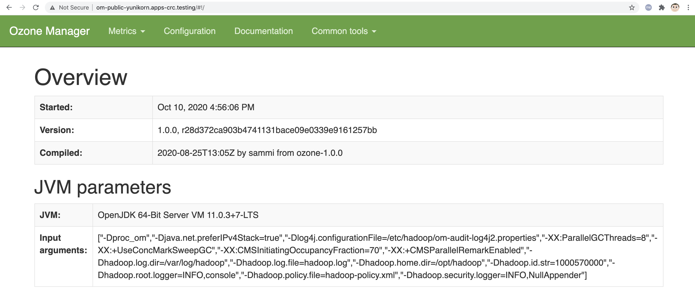
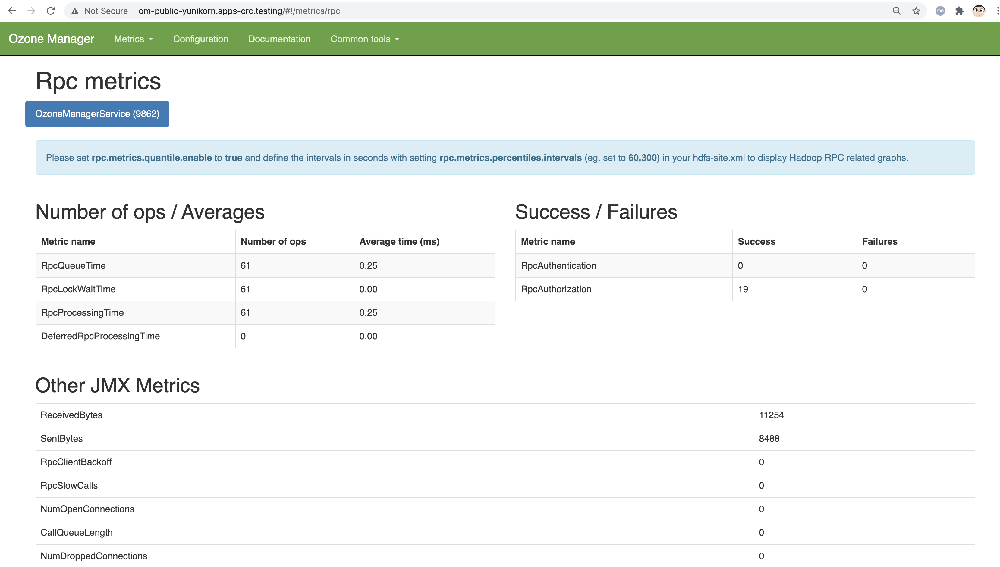

== Ozone on OpenShift 4.5+ / CodeReady Containers

See https://hadoop.apache.org/ozone/

----
Ozone is a scalable, redundant, and distributed object store for Hadoop. 

Apart from scaling to billions of objects of varying sizes, 
Ozone can function effectively in containerized environments such as Kubernetes and YARN.

Applications using frameworks like Apache Spark, YARN and Hive work natively without any modifications.

Ozone is built on a highly available, replicated block storage layer called Hadoop Distributed Data Store (HDDS).
----

== Install CodeReady Containers on a baremetal server with RHEL 8.4

Install CodeReady Containers on a baremetal server with RHEL 8.4
as shown at https://github.com/marcredhat/crcdemos/blob/master/yunikorn/baremetal_README.adoc

NOTE: CodeReady Containers is an "all-in-one" virtual machine with OpenShift 4. If you'd like more flexibility to configure the number of masters, workers etc, then another option is to fully automate the installation of OpenShift 4.5+ (for lab/test purposes) on a baremetal server with KVM/libvirt; please see https://github.com/marcredhat/z/blob/master/zdt.adoc, starting at the "Install OpenShift 4" paragraph.

----
git clone https://github.com/apache/hadoop-ozone.git
----

----
export PATH=$PATH:/home/user/.crc/bin/oc
crc console --credentials
oc login -u kubeadmin -p <password>  https://api.crc.testing:6443
----

----
alias kubectl=oc
cd hadoop-ozone/hadoop-ozone/dist/src/main/k8s/examples/getting-started/

mv s3g-statefulset.yaml s3g-statefulset.yaml.orig
wget https://raw.githubusercontent.com/marcredhat/crcdemos/master/ozone/s3g-statefulset.yaml

mv om-statefulset.yaml om-statefulset.yaml.orig
wget https://raw.githubusercontent.com/marcredhat/crcdemos/master/ozone/om-statefulset.yaml

mv datanode-statefulset.yaml datanode-statefulset.yaml.orig
wget https://raw.githubusercontent.com/marcredhat/crcdemos/master/ozone/datanode-statefulset.yaml

mv scm-statefulset.yaml scm-statefulset.yaml.orig
wget https://raw.githubusercontent.com/marcredhat/crcdemos/master/ozone/scm-statefulset.yaml

kubectl apply -f .
----

----
Expected result:
configmap/config created
service/datanode-public created
service/datanode created
statefulset.apps/datanode created
service/om-public created
service/om created
statefulset.apps/om created
service/s3g-public created
service/s3g created
statefulset.apps/s3g created
service/scm-public created
service/scm created
statefulset.apps/scm created
----

----
oc get pods
NAME         READY   STATUS    RESTARTS   AGE
datanode-0   1/1     Running   0          63s
datanode-1   1/1     Running   0          59s
datanode-2   1/1     Running   0          54s
om-0         1/1     Running   0          63s
s3g-0        1/1     Running   0          63s
scm-0        1/1     Running   0          63s
----

----
oc get svc
NAME              TYPE        CLUSTER-IP       EXTERNAL-IP   PORT(S)          AGE
datanode          ClusterIP   None             <none>        9870/TCP         13s
datanode-public   NodePort    172.25.187.102   <none>        9870:30026/TCP   13s
om                ClusterIP   None             <none>        9874/TCP         13s
om-public         NodePort    172.25.135.25    <none>        9874:32137/TCP   13s
s3g               ClusterIP   None             <none>        9878/TCP         13s
s3g-public        NodePort    172.25.187.111   <none>        9878:32231/TCP   13s
scm               ClusterIP   None             <none>        9876/TCP         13s
scm-public        NodePort    172.25.159.197   <none>        9876:30766/TCP   13s
----

----
oc expose svc om-public
----

----
oc get route
NAME         HOST/PORT                              PATH   SERVICES     PORT   TERMINATION   WILDCARD
om-public    om-public-yunikorn.apps-crc.testing           om-public    ui                   None
----

On your laptop, edit /etc/hosts to point
om-public-yunikorn.apps-crc.testing
to 127.0.0.1

Then, use SSH port forwarding e.g.
sudo ssh root@<remote baremetal server> -L 80:om-public-yunikorn.apps-crc.testing:80 -L 443:console-openshift-console.apps-crc.testing:443

 

----
sed -i 's/kubectl/oc/g' ../testlib.sh
----

== Create buckets using AWS CLI

----
oc expose svc s3g
----

----
oc get route
NAME         HOST/PORT                              PATH   SERVICES     PORT   TERMINATION   WILDCARD
om-public    om-public-yunikorn.apps-crc.testing           om-public    ui                   None
s3g          s3g-yunikorn.apps-crc.testing                 s3g          rest                 None
----

== Install the AWS CLI that we'll use for Ozone operations

----
curl "https://awscli.amazonaws.com/awscli-exe-linux-x86_64.zip" -o "awscliv2.zip"
unzip awscliv2.zip
sudo ./aws/install
----

== Configure the AWS CLI that we'll use for Ozone operations

----
You can set the AWS Access Key ID and AWS Secret Access Key to any value 
as security is not configured by default.

This is an on-prem environment so 
the AWS region specified below will not be used  
but should be specified according to the AWS region format e.g. us-west-1

Use json as default output format 

aws configure
AWS Access Key ID [****************0]: 0
AWS Secret Access Key [****************0]: 0
Default region name [us-west-1]: us-west-1
Default output format [0]: json
----

----
aws s3api --endpoint http://s3g-yunikorn.apps-crc.testing create-bucket --bucket=ozonemarcbucket
----

----
Expected result:
aws s3api --endpoint http://s3g-yunikorn.apps-crc.testing create-bucket --bucket=ozonemarcbucket
{
    "Location": "http://s3g-yunikorn.apps-crc.testing/ozonemarcbucket"
}
----

----
In another terminal window:

oc logs s3g-0 --follow
----

----
Expected result:
2020-10-10 23:55:57 INFO  ContextHandler:825 - Started o.e.j.w.WebAppContext@531ec978{s3gateway,/,file:///tmp/jetty-0_0_0_0-9878-hadoop-ozone-s3gateway-1_0_0_jar-_-any-17246356189179812948.dir/webapp/,AVAILABLE}{jar:file:/opt/hadoop/share/ozone/lib/hadoop-ozone-s3gateway-1.0.0.jar!/webapps/s3gateway}
2020-10-10 23:55:57 INFO  AbstractConnector:330 - Started ServerConnector@81d9a72{HTTP/1.1,[http/1.1]}{0.0.0.0:9878}
2020-10-10 23:55:57 INFO  Server:399 - Started @4634ms
2020-10-10 23:55:57 INFO  BaseHttpServer:327 - HTTP server of s3gateway listening at http://0.0.0.0:9878
.....
2020-10-11 01:08:42 INFO  RpcClient:459 - Creating Bucket: s3v/ozonemarcbucket, with Versioning false and Storage Type set to DISK and Encryption set to false
2020-10-11 01:08:42 INFO  BucketEndpoint:205 - Location is /ozonemarcbucket
----

----
aws s3api --endpoint http://s3g-yunikorn.apps-crc.testing list-buckets
{
    "Buckets": [
        {
            "Name": "ozonemarcbucket",
            "CreationDate": "2020-10-11T01:08:42.914000+00:00"
        },
        {
            "Name": "test",
            "CreationDate": "2020-10-11T00:24:08.291000+00:00"
        },
        .....
    ]
}
----

== Check the Ozone Manager metrics

 

== Build the Ozone/Hadoop Distribute Data Store subprojects on RHEL 8.4

See https://cwiki.apache.org/confluence/display/HADOOP/How+To+Contribute+to+Ozone

----
git clone https://github.com/apache/hadoop-ozone.git
cd hadoop-ozone/hadoop-ozone

mv pom.xml pom.xml.orig
wget https://raw.githubusercontent.com/marcredhat/crcdemos/master/ozone/pom.xml

mvn clean install package -DskipShade -DskipRecon -DskipTests -Pdist -Dtar
----

----
Expected result:
[INFO] Reactor Summary:
[INFO]
[INFO] Apache Hadoop HDDS ................................. SUCCESS [  2.454 s]
[INFO] Apache Hadoop HDDS Hadoop Client dependencies ...... SUCCESS [  1.923 s]
[INFO] Apache Hadoop HDDS Hadoop Test dependencies ........ SUCCESS [  3.432 s]
[INFO] Apache Hadoop HDDS Hadoop Server dependencies ...... SUCCESS [  2.954 s]
[INFO] Apache Hadoop HDDS Client Interface ................ SUCCESS [ 27.502 s]
[INFO] Apache Hadoop HDDS Admin Interface ................. SUCCESS [ 15.173 s]
[INFO] Apache Hadoop HDDS Server Interface ................ SUCCESS [ 19.835 s]
[INFO] Apache Hadoop HDDS Test Utils ...................... SUCCESS [  4.173 s]
[INFO] Apache Hadoop HDDS Config .......................... SUCCESS [  3.674 s]
[INFO] Apache Hadoop HDDS Common .......................... SUCCESS [ 13.256 s]
[INFO] Apache Hadoop HDDS Client .......................... SUCCESS [  8.462 s]
[INFO] Apache Hadoop HDDS Server Framework ................ SUCCESS [ 13.622 s]
[INFO] Apache Hadoop HDDS/Ozone Documentation ............. SUCCESS [  0.944 s]
[INFO] Apache Hadoop HDDS Container Service ............... SUCCESS [ 14.801 s]
[INFO] Apache Hadoop HDDS SCM Server ...................... SUCCESS [ 13.698 s]
[INFO] Apache Hadoop HDDS Tools ........................... SUCCESS [  6.900 s]
[INFO] Apache Hadoop Ozone 1.1.0-SNAPSHOT ................. SUCCESS [  1.135 s]
----

== Useful links

https://cwiki.apache.org/confluence/display/HADOOP/How+To+Contribute+to+Ozone

https://github.com/apache/hadoop-ozone/tree/master/hadoop-ozone/dist/src/main/k8s/examples/getting-started

https://github.com/marcredhat/crcdemos/blob/master/yunikorn/baremetal_README.adoc

