== Sysdig runtime security on OpenShift 4.3.1+ 

From the OpenShift console, go to OperatorHub and deploy the Sysdig Agent Operator

image:./images/1sysdig.png[title="Generated diagram"]

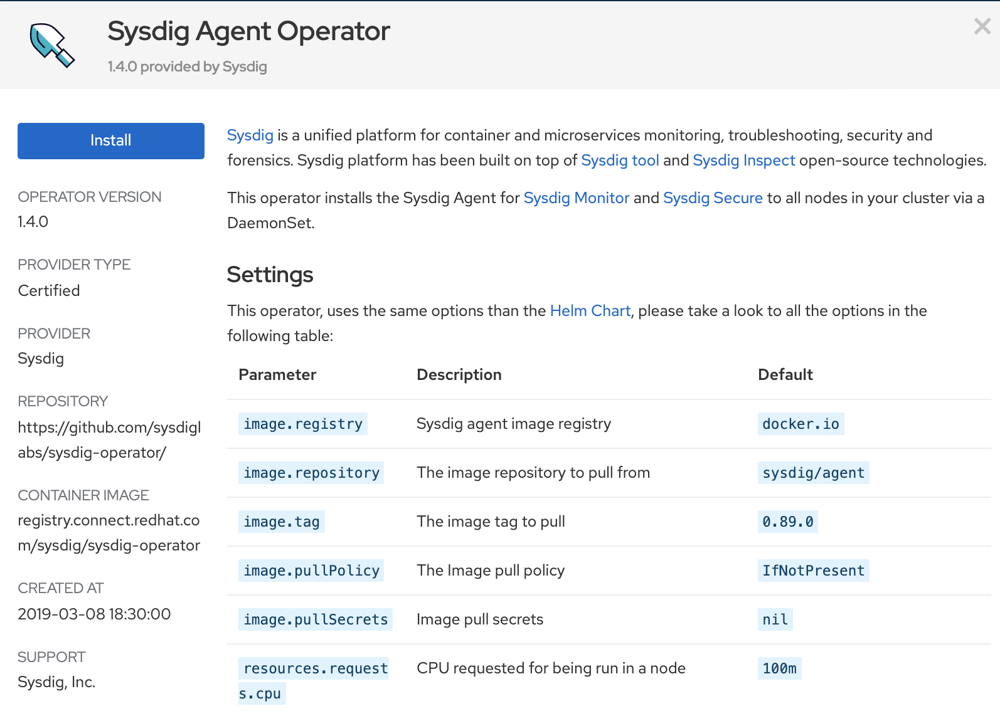

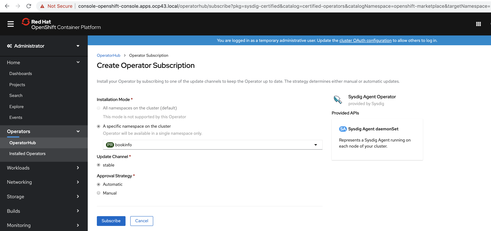

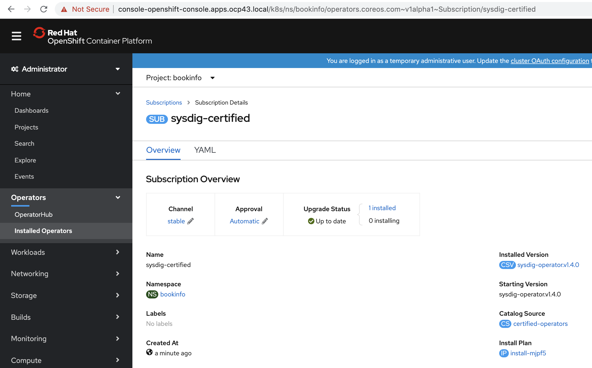

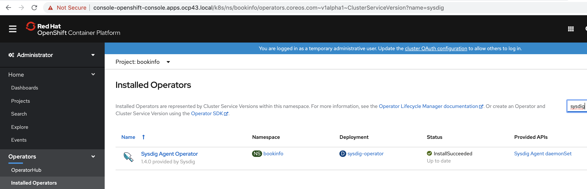

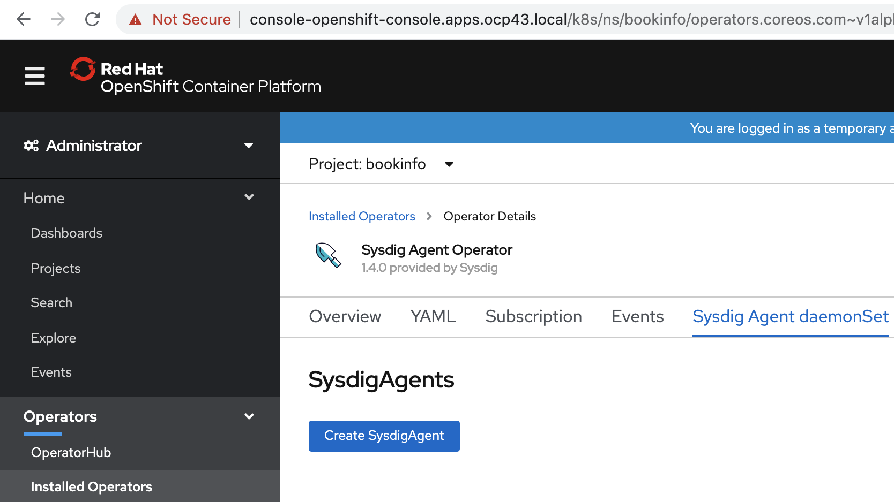

----
Get your access key from secure.sysdig.com (Settings / Agent Installation)
----

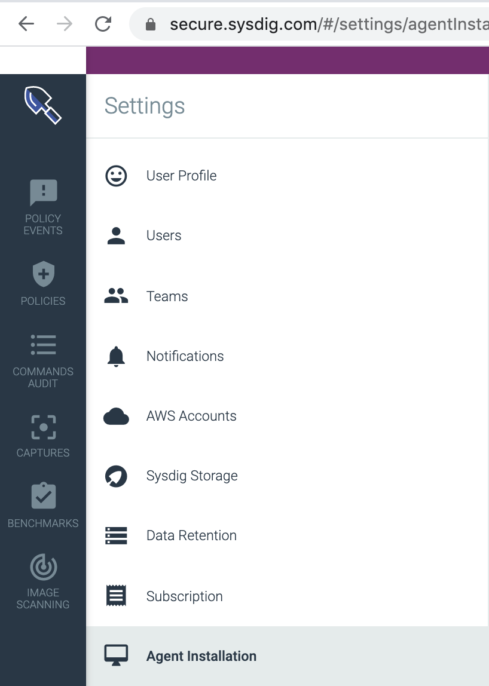

----
#https://github.com/sysdiglabs/sysdig-operator
apiVersion: sysdig.com/v1alpha1
kind: SysdigAgent
metadata:
  name: agent-with-ebpf-and-secure
spec:
  ebpf:
    enabled: false
  secure:
    enabled: true
  image:
    tag: latest
  sysdig:
    accessKey: <access key>
----

image:./images/9sysdig.png[title="Generated diagram"]

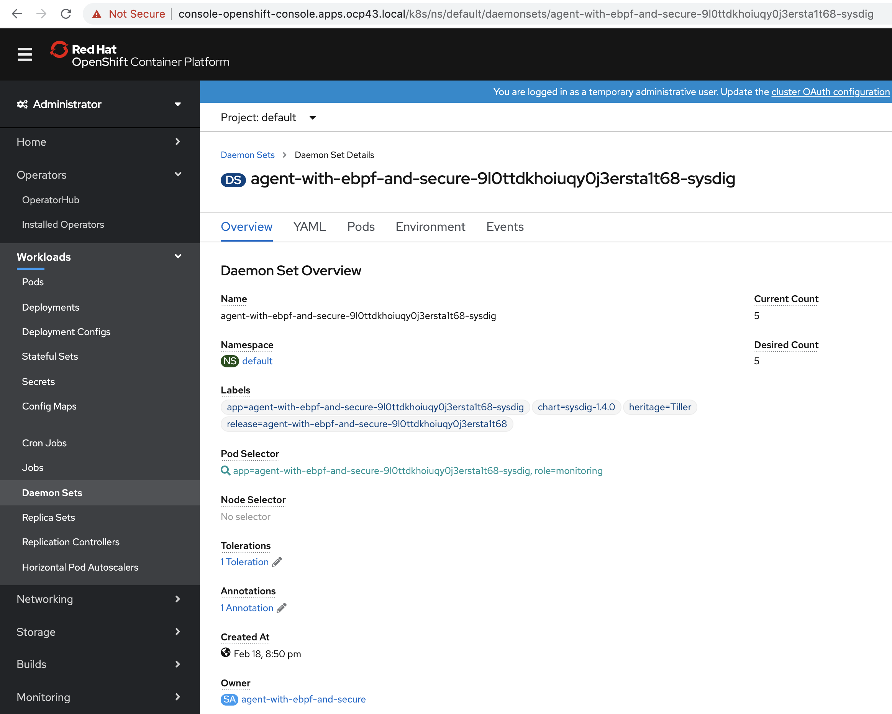

== Monitoring OpenShift 4.3.1+ with Sysdig

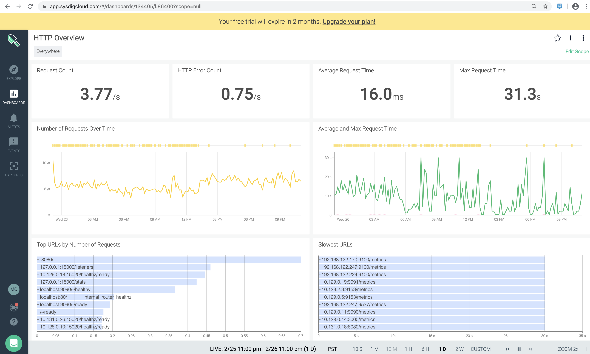

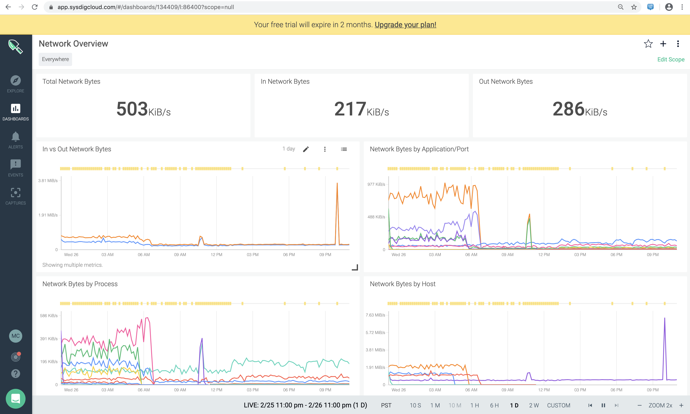

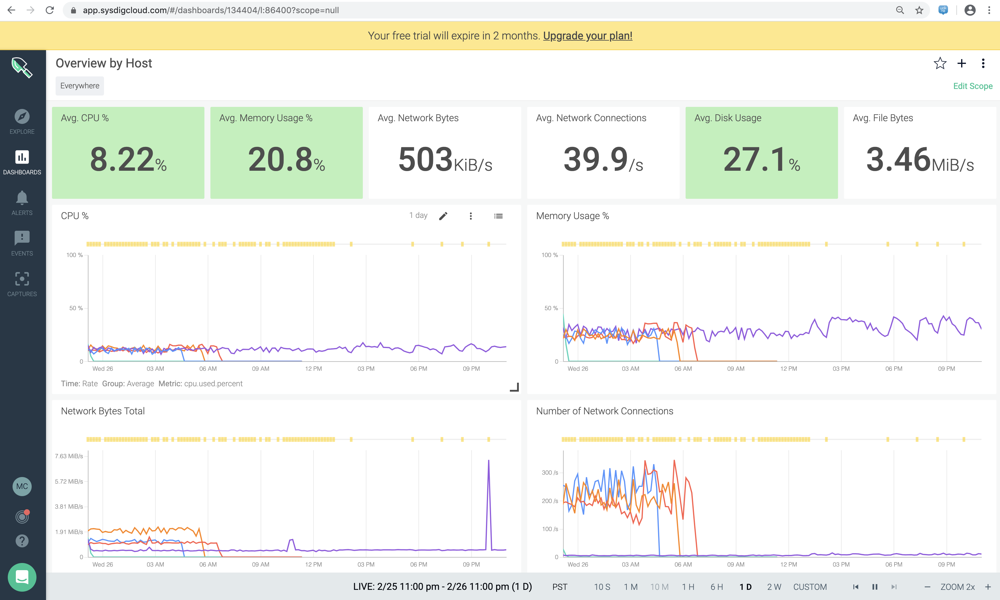

== Runtime security for OpenShift 4.3.1+ with Sysdig

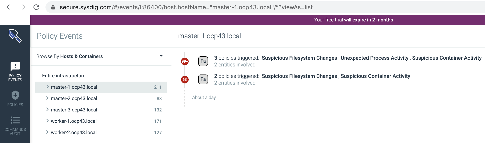

See short video showing Sysdig runtime security on OpenShift 4.2+ at https://youtu.be/dWmeZVLPlR0

== Audit commands running in containers

----
Create a DaemonSet with an inage containing tcdump
----

----
cat tcpdumpds.yaml
apiVersion: extensions/v1beta1
kind: DaemonSet
metadata:
  name: tcpdump
spec:
  template:
    metadata:
      labels:
        marc: tcpdump
    spec:
      nodeSelector:
        marc: tcpdump-node
      containers:
        - name: tcpdump
          image: corfr/tcpdump
          command:
          - bin/sleep
          - infinity
----

----
oc label node worker-1.ocp43.local marc=tcpdump-node
oc label node worker-2.ocp43.local marc=tcpdump-node
----

----
oc rsh tcpdump-9prsr
/ # tcpdump -i any port 8888
tcpdump: verbose output suppressed, use -v or -vv for full protocol decode
listening on any, link-type LINUX_SLL (Linux cooked), capture size 262144 bytes
----

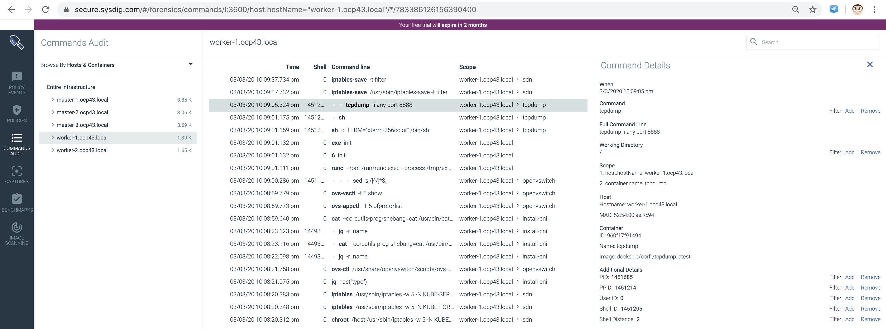

