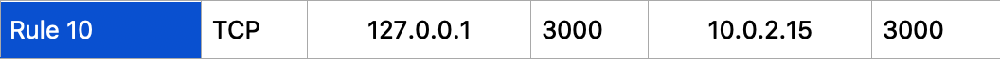
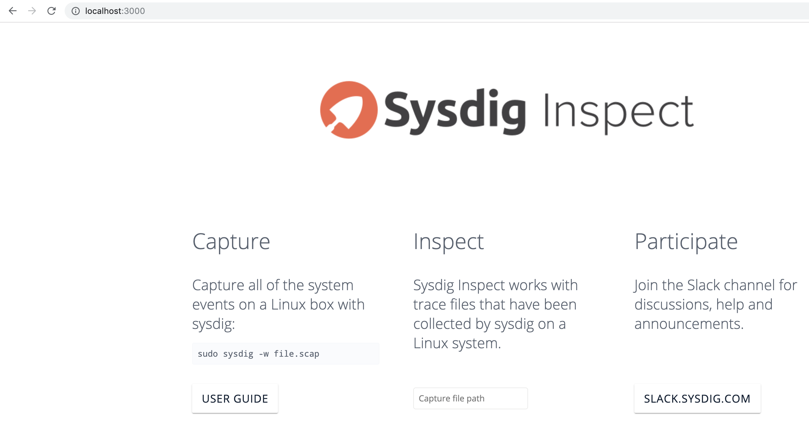
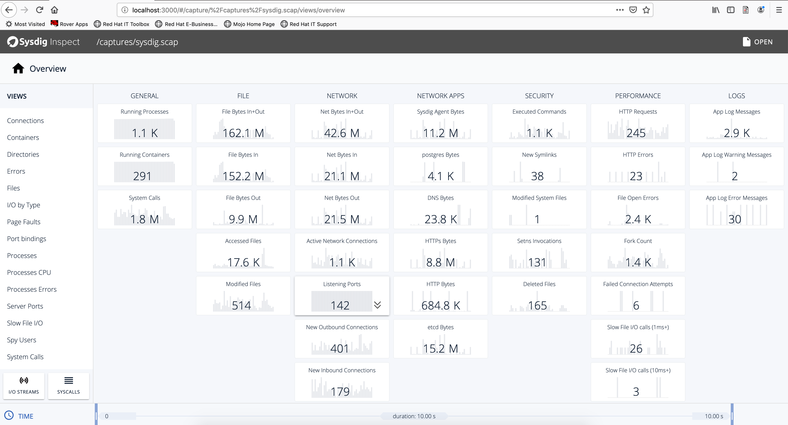

On my VirtualBox virtual machine:
[marc@rhel8ga ~]$ lsb_release -a

----
LSB Version:	:core-4.1-amd64:core-4.1-noarch
Distributor ID:	RedHatEnterprise
Description:	Red Hat Enterprise Linux release 8.0 (Ootpa)
Release:	8.0
Codename:	Ootpa
----

[marc@rhel8ga ~]$ sudo  podman run -d -v /local/path/to/captures:/captures --net=host sysdig/sysdig-inspect:latest

Copy the Sysdig captures to the folder that will be mounted by the sysdig-inspect container

----
[marc@rhel8ga captures]$ pwd
/local/path/to/captures
[marc@rhel8ga captures]$ ls
sysdig.scap
----

On my laptop:

Configure the following port forwarding rule in VirtualBox:

sudo ssh marc@localhost -p <port> -L 3000:localhost:3000

On my laptop, browse to http://localhost:3000

Load from the folder mounted by the sysdig-inspect container, /captures/sysdig.scap in this example

