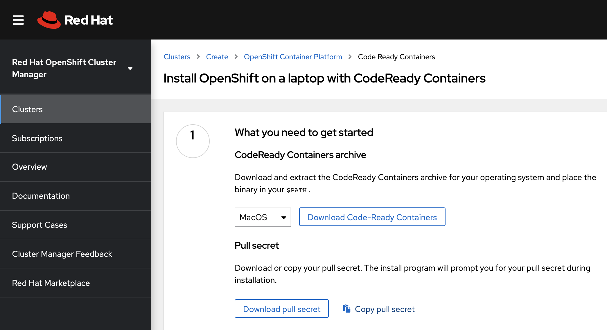
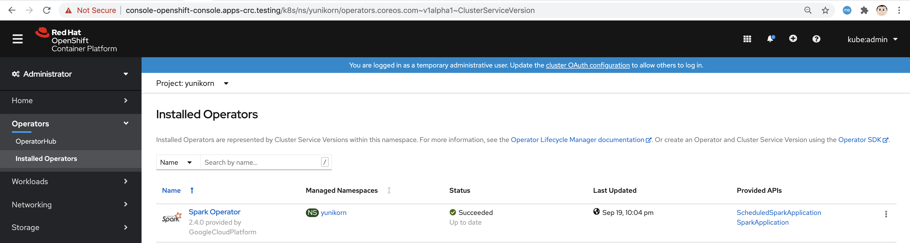
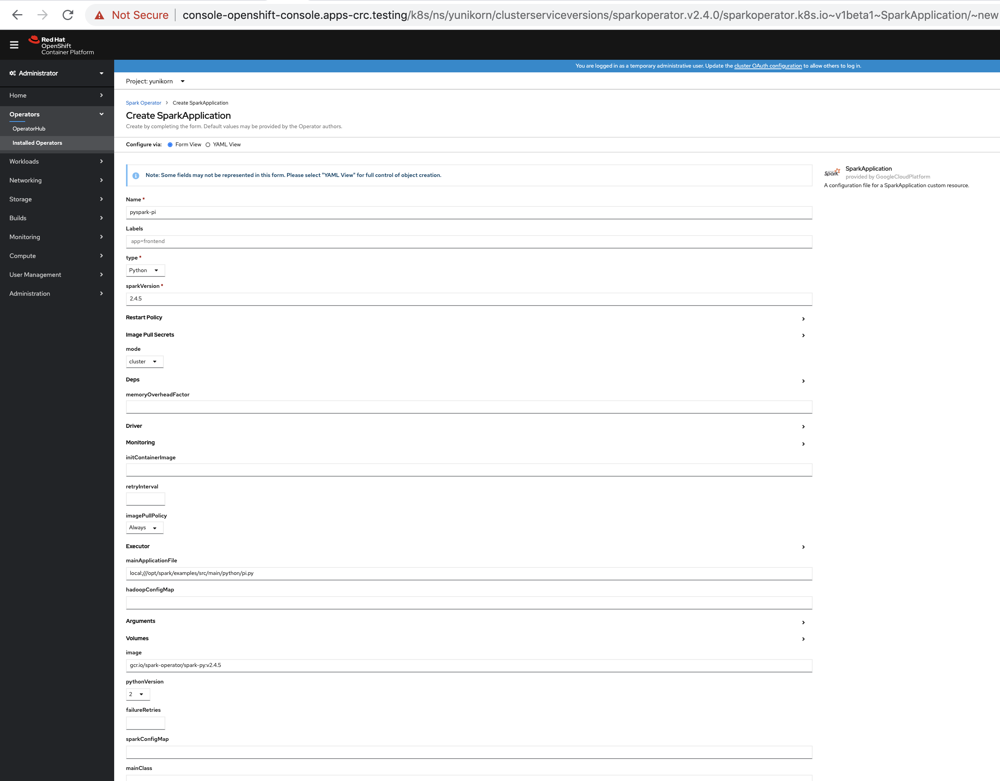

== Automated install of OpenShift 4.5 with Yunikorn scheduler for BigData and ML 
== on your laptop, virtual machine or baremetal server using CodeReady Containers

NOTE: You'll need 16GB of RAM. 

See https://yunikorn.apache.org/

----
From https://developers.redhat.com/products/codeready-containers/download:

1. Download CodeReady Containers in the current folder. I'm on a Mac so I'm using crc-macos-amd64.tar.xz.
   CodeReady Containers is also available for Linux and Windows.
   
   Select your OS from the dropdown list then Click on "Download". 
   
   You'll be asked to connect using your Red Hat login. 
   
   If you don't have one, just click on "Create one now". You do NOT need a Red Hat subscription for this.

   Once logged in, the following page will be displayed to 
   allow you to download CodeReady Containers AND the pull secret.
----

----
git clone https://github.com/marcredhat/crcdemos.git

cd crcdemos/keptn

sudo chmod +x ./*.sh

In the current folder (keptn), 
edit crc.sh to configure the memory e.g. 
crc config set memory 16000 (for 16GB of RAM)
crc config set cpus 32 (for 32 logical cores)
----

----
3. Copy  your pull secret to the current folder in a file called pullsecret.txt
----

----
4. Copy the CodeReady Containers archive that you downloaded in step 1 to the current folder
   e.g. crc-macos-amd64.tar.xz if you are on a Mac.
----

----
./crc.sh will extract the CodeReady archive so please edit it to 
make sure it uses the correct archive for your system (Mac or Linux)

Running the following will install OpenShift 4.5, display the login info and open a browser window with the OpenShift console
./crc.sh
----

----
This will install OpenShift 4.5, display the login info and open a browser window with the OpenShift console.
INFO To access the cluster, first set up your environment by following 'crc oc-env' instructions
INFO Then you can access it by running 'oc login -u developer -p developer https://api.crc.testing:6443'
INFO To login as an admin, run 'oc login -u kubeadmin -p DhjTx-8gIJC-2h2tK-eksGY https://api.crc.testing:6443'
INFO
INFO You can now run 'crc console' and use these credentials to access the OpenShift web console
Started the OpenShift cluster
WARN The cluster might report a degraded or error state. This is expected since several operators have been disabled to lower the resource usage. For more information, please consult the documentation
Opening the OpenShift Web Console in the default browser...
----

----
Login as kubeadmin with the password displayed by the previous command 
----

----
alias kubectl=oc
helm repo add yunikorn  https://apache.github.io/incubator-yunikorn-release
helm repo update
kubectl create namespace yunikorn
helm install yunikorn yunikorn/yunikorn --namespace yunikorn
----

----
I had to add 
serviceAccount: yunikorn-admin 
serviceAccountName: yunikorn-admin to 
the yunikorn-admission-controller Deployment:

oc create -f https://raw.githubusercontent.com/marcredhat/crcdemos/master/yunikorn/yunikorn-admission-controller.yaml
----

----
Deploy the Spark Operator
----

----
Click on "SparkApplication" under "Provided APIs"
Replace the 2.4.0 with 2.4.5 under "sparkVersion" and "image"
----

----
Check the YuniKorn Scheduler logs:
oc logs yunikorn-scheduler-65485b8d97-76s2q -c yunikorn-scheduler-k8s --follow
----

