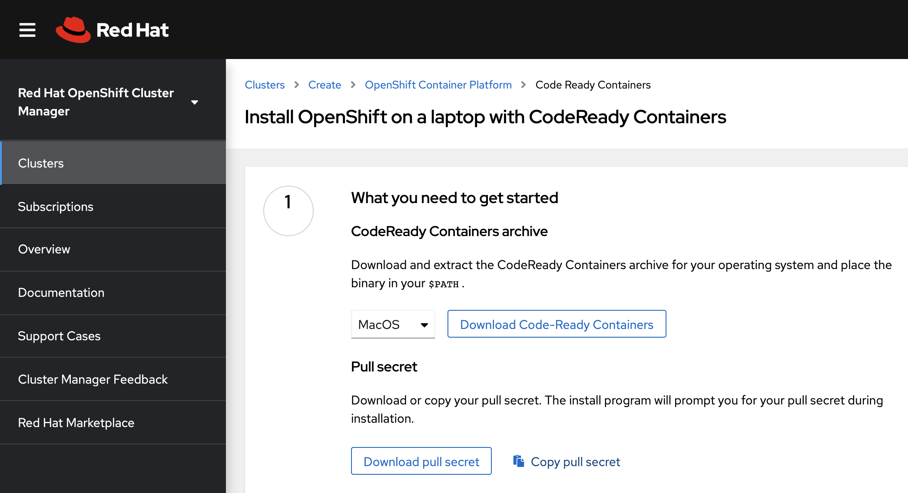
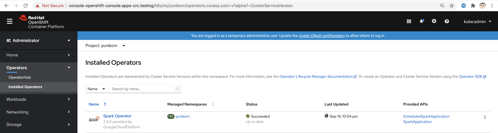

== Automated install of OpenShift 4.5 with Yunikorn scheduler for BigData and ML 
== on a Linux baremetal server using CodeReady Containers

NOTE: You'll need 16GB of RAM. 

See https://yunikorn.apache.org/

NOTE: On a Linux system, do not install CodeReady Containers as root. 

----
Get your pull secret
----

Browse to https://developers.redhat.com/products/codeready-containers/download

----
Click on "Download"
----

----
You'll be asked to connect using your Red Hat login. 
   
If you don't have one, just click on "Create one now". You do NOT need a Red Hat subscription for this.

Once logged in, the following page will be displayed to 
allow you to download the pull secret.
----

----
Fork/clone the following repo

git clone https://github.com/marcredhat/crcdemos.git

cd crcdemos/keptn

sudo chmod +x ./crclinux.sh
----

----
Copy  your pull secret to the current folder in a file called pull-secret.txt
----

----
Set the memory and logical cores that you want to make available to CodeReady Containers

Example for 128GB of RAM and 128 logical cores:

export CRCMEM=128000

export CRCCPUS=128
----

----
The following scripts will download, install and configure the latest version 
of CodeReady Containers

./crclinux.sh
----

----
This will install OpenShift 4.5, display the login info and open a browser window with the OpenShift console.
INFO To access the cluster, first set up your environment by following 'crc oc-env' instructions
INFO Then you can access it by running 'oc login -u developer -p developer https://api.crc.testing:6443'
INFO To login as an admin, run 'oc login -u kubeadmin -p DhjTx-8gIJC-2h2tK-eksGY https://api.crc.testing:6443'
INFO
INFO You can now run 'crc console' and use these credentials to access the OpenShift web console
Started the OpenShift cluster
----

NOTE: The cluster might report a degraded or error state. This is expected since several operators have been disabled to lower the resource usage. 

----
Login as kubeadmin with the password displayed by the previous command e.g.
oc login -u kubeadmin -p DhjTx-8gIJC-2h2tK-eksGY https://api.crc.testing:6443
----

== OpenShift console access

NOTE: You can use `crc console --credentials` to display your credentials

----
If you are installing CodeReady Containers on a remote baremetal server, 
you'll need to do the following in order to connect from your laptop:

On your laptop, edit /etc/hosts to point  
console-openshift-console.apps-crc.testing and 
oauth-openshift.apps-crc.testing
to 127.0.0.1

Then, use SSH port forwarding e.g.
sudo ssh root@<remote baremetal server> -L 7180:localhost:7180 -L 443:console-openshift-console.apps-crc.testing:443 -L 443:oauth-openshift.apps-crc.testing:443

From your laptop, you can now connect to the remote OpenShift console at 
https://console-openshift-console.apps-crc.testing
----

----
alias kubectl=oc
helm repo add yunikorn  https://apache.github.io/incubator-yunikorn-release
helm repo update
kubectl create namespace yunikorn
helm install yunikorn yunikorn/yunikorn --namespace yunikorn
----

----
I had to add 
serviceAccount: yunikorn-admin 
serviceAccountName: yunikorn-admin to 
the yunikorn-admission-controller Deployment:

oc create -f https://raw.githubusercontent.com/marcredhat/crcdemos/master/yunikorn/yunikorn-admission-controller.yaml
----

----
Deploy the Spark Operator
----

----
Click on "SparkApplication" under "Provided APIs"
Replace the 2.4.0 with 2.4.5 under "sparkVersion" and "image"
----

image:images/spark2.png[title="Spark2"]

----
Check the YuniKorn Scheduler logs:
oc logs yunikorn-scheduler-65485b8d97-76s2q -c yunikorn-scheduler-k8s --follow
----

